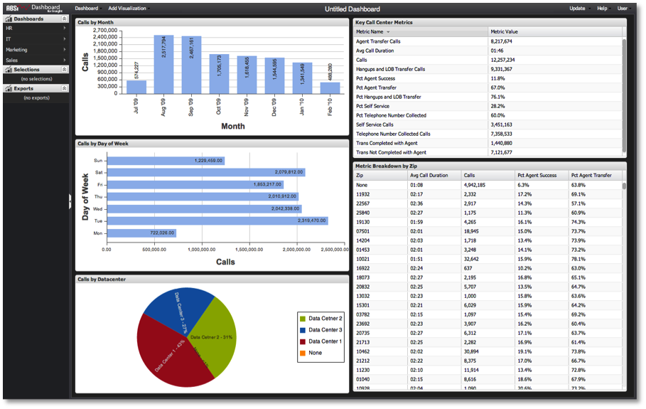

# 创建仪表板{#creating-a-dashboard}

{{eol}}

即使是短期临时分析需求，也建议创建功能板。

>[!NOTE]
>
>只读用户无法创建功能板。 此部分仅适用于普通用户和管理员。

用户可出于以下几个原因决定创建功能板：

* 可以从头开始新功能板，以便进行即时分析，而无意重用或共享该功能板。
* 可以创建新功能板，以执行您自己的个人分析，您希望保存和重复使用这些功能板，但不希望共享。
* 可以创建、保存和共享新功能板，以供您和其他功能板用户群访问。 无论出现什么情况，每种情景都从同一点开始：空白仪表板画布。

>[!NOTE]
>
>在开始构建功能板之前，最好将“查询对象”百分比降低到较低值，如10%或25%。 这比执行完整查询要快得多，从Data Workbench中提取数据样本。 由于这些采样结果返回的速度要快得多，因此在构建功能板和分析框架时，它可提供理想的响应性。 准备好运行查询以完成后，您可以将查询到参数更新为100%。 要调整查询完成，请参阅 [查询对象参数](../../../home/c-adobe-data-workbench-dashboard/c-dashboards/c-query-to-parameter.md#concept-33db106e28bc4108bca9e8d0a440d323).

要创建新功能板，请选择 **[!UICONTROL New]** 下。

您将看到一个空白的功能板画布，该画布已准备好根据您的分析需求添加和配置可视化图表。 工作时，在保存之前，服务器上不会有任何更新。

接下来，确定要显示哪种类型的数据以及要显示的方式。 通常，首先可以使用表格可视化图表来查看原始数据，然后根据需要构建其他图表。 有关如何添加和配置可视化的详细信息，请参阅 [创建可视化图表](../../../home/c-adobe-data-workbench-dashboard/c-visualizations/t-creating-visualizations.md#task-c6f1d20fa2484aeeb9a8487625054ecf). 添加并配置可视化以构建功能板后，您将最终获得以下信息：

从此开始，您只需执行分析并放弃功能板，或选择将功能板保存到服务器以重复使用和/或共享。 有关如何与功能板进行交互以执行分析的信息，请参阅部分 [在功能板中进行选择](../../../home/c-adobe-data-workbench-dashboard/c-making-selections-within-the-dashboard/c-making-selections-within-the-dashboard.md#concept-0989862de0044cc4bbfd7f4441275fc4).
