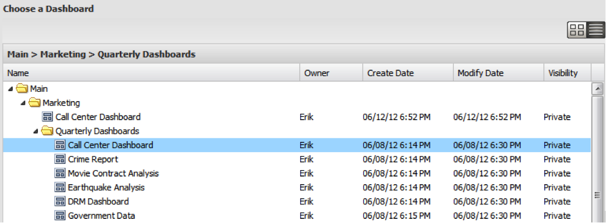

# 仪表板浏览器视图{#dashboard-browser-views}

{{eol}}

说明缩略图视图和列表视图。

有两个视图可用于在功能板浏览器中导航功能板：缩略图视图和列表视图。 缩略图视图在您浏览时提供功能板的缩略图，而列表视图则是可用功能板的以表格为基础的、更详细的视图。

## 缩略图视图 {#section-b522ce5e6e184ef9a0e1b9a42f7a9ae0}

缩略图视图提供与您有权访问的功能板对应的缩略图库。 如果缩略图显示默认图标，请联系您的管理员为该功能板建立缩略图。 利用搜索栏左侧的图标，可在缩略图和列表视图之间切换。

在缩略图视图中，功能板浏览器的左侧导航面板显示组织功能板存储的文件夹层次结构。 要查看文件夹的内容，请单击该文件夹，以在功能板浏览器的中心面板中将其内容显示为缩略图。 如果文件夹的该级别中没有保存的功能板，则窗口的中心面板中将显示消息“此位置中没有功能板”。

您还可以通过单击目标文件夹左侧的箭头来浏览子文件夹。 这将展开您选择的文件夹中子文件夹和功能板的列表。 通过选择至少包含一个功能板的文件夹，中心面板将显示位于该选择级别的每个功能板的缩略图。 中心面板标题也将发生更改，以指示所选文件夹的路径。

然后，您可以通过单击来选择感兴趣的功能板。 单击功能板缩略图后，右侧框架将填充有关功能板的详细信息。 功能板详细信息包含所选功能板的缩略图视图、其名称、简要说明、所有者、创建日期、上次修改日期、用于编译数据的配置文件、可见性控件和提供一系列操作选项。

## 列表视图 {#section-aa79d51168a7430ea2816413dc6cc73a}

列表视图提供有关您有权访问的功能板的基于表格的信息。 列表视图表格中的每一行都表示一个唯一的仪表板。 单击列标题将允许您按该列对表进行降序或升序排序。

单击功能板条目将在功能板浏览器的右侧面板中显示功能板的详细信息。 要在视图之间切换，请重新选择所需的视图选项。
