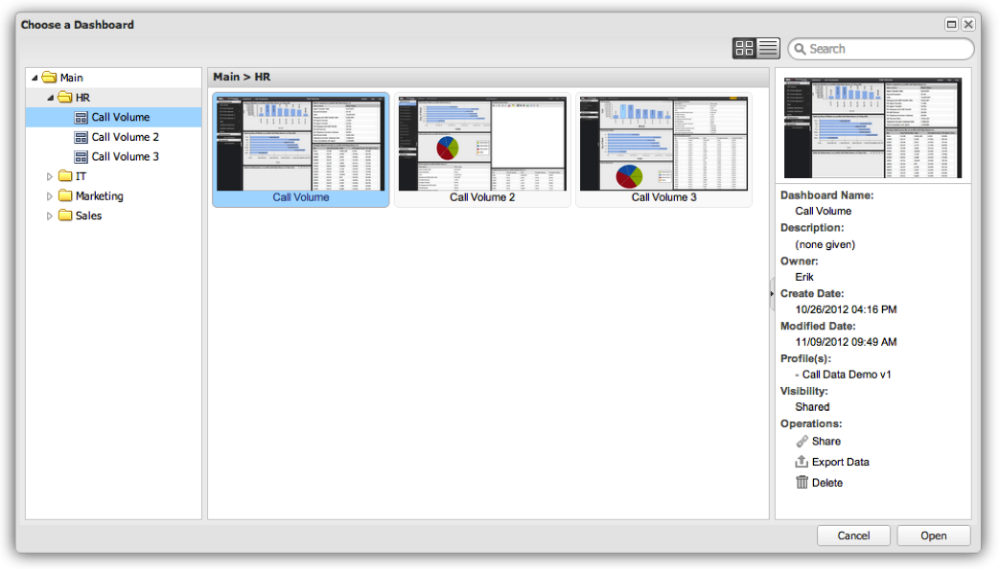

# 功能板浏览器{#dashboard-browser}

功能板浏览器便于浏览、搜索和打开您和您组织的其他成员创建和保存的功能板。

您可以浏览并访问您有权查看的所有仪表板（有关访问控制的详细信息，请参阅访问控制一节）。 当您需要查找功能板但不确定您需要哪个功能板或其所在位置时，功能板浏览器会正常工作。 功能板浏览器对于获取附加详细信息以及在给定的功能板上执行特殊功能也很有用。

## 打开功能板浏览器 {#section-10e158d738684219ab997ef050b675d7}

登录到Adobe Data Workbench功能板时，默认情况下将显示功能板浏览器。 您还可以随时通过单击工具栏中的功能板菜单并选择来访问功能板浏览器 **[!UICONTROL Browse…]**。

