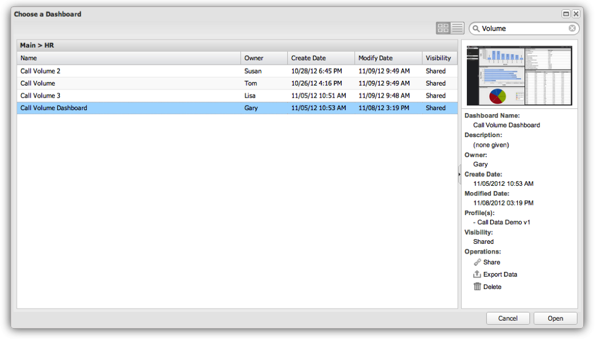

# 在仪表板浏览器中搜索{#searching-within-the-dashboard-browser}

{{eol}}

功能板浏览器还允许您执行搜索以查找现有功能板。

要执行搜索，请使用功能板浏览器工具栏中的搜索框。 当您键入时，您的搜索结果将显示在功能板浏览器中。 您可以随时通过删除搜索文本或单击 **[!UICONTROL X]** 的双曲余切值。

您还可以使用每个列标题中的排序函数对结果进行排序。 单击列标题将切换该列的排序。 您还可以使用每个列标题上的下拉菜单访问排序选项。

此 **[!UICONTROL Columns]** 菜单还允许您修改功能板列表视图中的可见列。 在此，您可以通过选择或取消选择所选列来切换列的可见性。

## “详细信息”面板 {#section-e1e5a5a0f9cc4eb89b0b94764587ae9c}

功能板详细信息面板显示功能板的详细信息以及功能板的缩略图版本。 在面板中找到的信息包括功能板的名称、简要说明、所有者和创建日期、上次修改日期以及用于创建功能板的用户档案。 此面板中还提供了功能板的可见性（无论是私有还是共享）。
