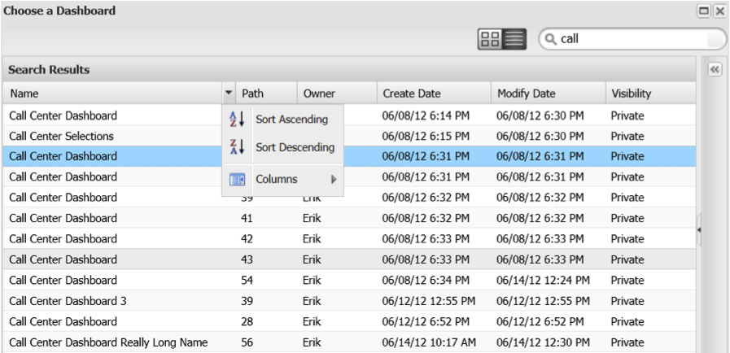

# 在功能板浏览器中搜索{#searching-within-the-dashboard-browser}

仪表板浏览器还允许您执行搜索以查找现有仪表板。

要执行搜索，请使用仪表板浏览器工具栏中的搜索框。 键入时，您的搜索结果将显示在仪表板浏览器中。 您可以随时删除搜索文本或单击搜索框中的&#x200B;**[!UICONTROL X]**&#x200B;图标来清除搜索。

您还可以使用每个列标题中的排序函数对结果进行排序。 单击列标题将切换该列的排序。 您还可以使用每个列标题上的下拉菜单访问排序选项。

此&#x200B;**[!UICONTROL Columns]**&#x200B;菜单还允许您修改仪表板列表视图中的可见列。 在此，可以通过选择或取消选择所选列来切换列的可见性。

## 详细信息面板{#section-e1e5a5a0f9cc4eb89b0b94764587ae9c}

仪表板详细信息面板显示仪表板的详细信息以及仪表板的缩略图版本。 面板中的信息包括仪表板的名称、简要说明、所有者和创建日期、修改该仪表板的最后日期以及用于创建该的用户档案。 仪表板的可见性（无论是私有的还是共享的）在此面板中也可用。
