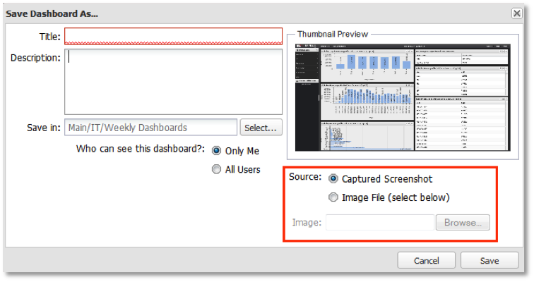

# 保存功能板{#saving-a-dashboard}

1. 要保存新功能板，请从功能板界面顶部的功能板菜单中选择&#x200B;**[!UICONTROL Save]**&#x200B;或&#x200B;**[!UICONTROL Save As…]**。 对于新功能板，两个选项的结果相同。

   此操作将启动&#x200B;**[!UICONTROL Save New Dashboard]**&#x200B;窗口，您可以在该窗口中输入标题、简要说明和用于存储功能板的位置。

   >[!NOTE]
   >
   >功能板可以是专用功能板，也可以是共享功能板。 如果功能板在&#x200B;**[!UICONTROL Visibility]**&#x200B;字段中标记为&#x200B;**[!UICONTROL Private]**，则只有您（或系统管理员）才能查看和编辑该功能板。 如果功能板在&#x200B;**[!UICONTROL Visibility]**&#x200B;字段中标记为&#x200B;**[!UICONTROL Shared]**，则系统的每位用户都可以查看和编辑该功能板。

1. 在&#x200B;**[!UICONTROL Source]**&#x200B;字段下，选择用于表示功能板的图像缩略图。 默认情况下，功能板的屏幕截图将被用作功能板的缩略图。

   如果选择了&#x200B;**[!UICONTROL Captured Screenshot]**&#x200B;选项，则将使用此缩略图。 如果要使用其他图像文件，请选择&#x200B;**[!UICONTROL Image File]**&#x200B;选项，然后选择要表示功能板的图像。

   >[!NOTE]
   >
   >如果您的浏览器不支持屏幕截图捕获，则将使用默认屏幕截图。 在这种情况下，您可能希望选择一个图像文件来表示仪表板。

   

1. 单击&#x200B;**[!UICONTROL Save]**&#x200B;将功能板保存到服务器。 您将是此功能板的所有者，并将来对其拥有完全控制权。
