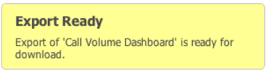

# 导出数据{#exporting-data}

显示3种导出数据的方式，以及如何检索导出。

可以通过三种方式从仪表板中导出数据。

首先，您可以从单个可视化中导出数据。 其次，您可以导出当前工作仪表板，包括您所做的任何配置和选择。 第三，您无需打开保存的仪表板即可导出它。

导出使用两步过程执行。 首先，使用上述三种方法之一在服务器上排队导出。 准备导出时，导出状态将显示在&#x200B;**[!UICONTROL Exports]**&#x200B;菜单中。 接下来，导出准备就绪后，您可以以CSV或Excel格式下载数据。

导出可能需要几分钟，但在导出过程中您可以继续使用应用程序。

## 导出可视化图表 {#section-46b74b46c2eb44129c8b85a9eabd2304}

要从可视化中导出数据，请单击可视化工具菜单中的&#x200B;**[!UICONTROL Save]**。

您的导出将在服务器上启动，并且“导出”菜单中将添加一个导出指示符。

## 导出仪表板{#section-27329f2a5fed44b49deb26dc5164531f}

要从工作仪表板启动数据导出，请从&#x200B;**[!UICONTROL Dashboard]**&#x200B;菜单中选择&#x200B;**[!UICONTROL Export]**。

您的导出将在服务器上启动，并且“导出”菜单中将添加一个导出指示符。

## 导出已保存的仪表板{#section-e989f7b16e25479ab77454f2c34471ba}

要从保存的仪表板启动仪表板导出，请使用Adobe Browser。 在仪表板浏览器中，浏览到所需的仪表板并选择它，以显示仪表板的详细信息。 在右侧的“详细信息”面板的&#x200B;**[!UICONTROL Operations]**&#x200B;部分下，选择&#x200B;**[!UICONTROL Export Data]**。

将在服务器上启动导出，并在&#x200B;**[!UICONTROL Exports]**菜单中添加一个导出指示器
.

## 检索导出{#section-0f03c5321c804867b7c72cf92f6f67d0}

导出完成后，将显示弹出通知，通知您导出已就绪。

要检索导出，请使用&#x200B;**[!UICONTROL Exports]**&#x200B;菜单。 单击所需导出项目右侧的绿色复选标记将显示下拉菜单。 在此菜单的&#x200B;**[!UICONTROL Save Export As…]**&#x200B;子菜单下，选择相应的菜单选项以下载CSV或Excel格式的导出。

您浏览器的文件下载过程现在已开始。

导出不会自动删除，因此您可以轻松下载每种格式的导出。 您可以从左侧导航面板的&#x200B;**[!UICONTROL Exports]**&#x200B;菜单中删除导出。 否则，在您注销时，系统会自动删除这些组件。

要从&#x200B;**[!UICONTROL Export List]**&#x200B;中删除导出，请单击导出标题右侧的复选标记，然后选择&#x200B;**[!UICONTROL Remove From List]**。

