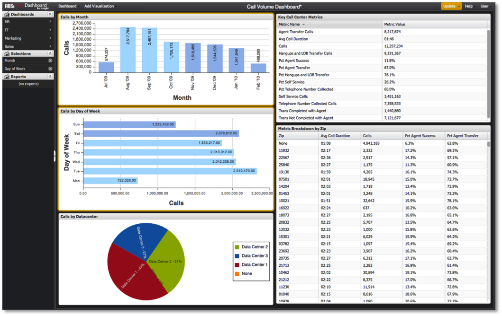

# 在功能板中选择{#making-selections-within-the-dashboard}

功能板中的数据可以通过使用选择轻松进行分段和探索。

单击可视化中的某些元素可进行选择，以标识功能板中的数据应如何进行分段。 在一个可视化中进行选择会将功能板内其他可视化中表示的数据进行分段。 任何数量的选择都可以随时进行、调整或移除，并鼓励用户与数据交互以导出分析信息。

保存功能板时，任何选择的状态都将在保存时保留。 同样，在加载功能板时，在保存期间保留的任何选择在加载功能板时都将生效。

通过单击功能板某个可视化图表中的一个或多个数据元素，可以进行选择。 数据元素由条形图中的条形图、柱状图中的列、表中的行等表示。 选择在进行时会突出显示，在可视化中进行选择将为可视化提供橙色边框。 进行选择的确切方法取决于所使用的可视化类型。

对于从可视化中进行的每项选择，“选择”菜单中也会显示一个条目。 此条目使用选定的维度名称列出，每个可视化中显示一个选择条目。

>[!NOTE]
>
>每次进行选择时，可视化数据不会自动更新。 相反，在做出所需的选择后，必须启动更新，才能对数据进行分段并更新可视化。
