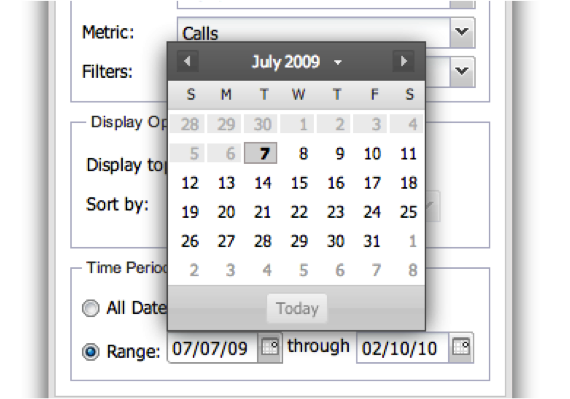

# 配置可视化图表{#configuring-visualizations}

显示如何配置标题、配置文件、Dimension、量度、过滤器、显示顶部、排序方式和时间段。

功能板画布上的每个可视化图表都有其自己的配置。 当可视化首次添加到功能板画布时，其配置窗口将自动显示。 配置完毕后，可以随时通过单击可视化窗口右上角的齿轮图标来修改可视化。

>[!NOTE]
>
>配置选项因所显示的可视化类型而略有不同。

## 可视化图表标题{#section-0414844283d745ae912e85f8ea14a51d}

利用此字段，可自定义在可视化顶部显示的标题。 默认情况下，标题设置为&#x200B;**[!UICONTROL Automatic Title]**，这将自动为可视化窗口生成标题。 通过清除&#x200B;**[!UICONTROL Automatic Title]**&#x200B;按钮，可以在此字段中放置任何标题。 （此字段适用于所有可视化图表。）

## 用户档案 {#section-16eb0def0a2d4eb289f5bb9200d14754}

利用此字段，可选择要显示其数据的用户档案。 单击下拉菜单将为您提供您有权访问的用户档案列表。 （此字段不适用于富文本可视化。）

配置文件是在Data Workbench中定义的数据集，其中包含有关特定域的数据，以及数据随附的维度、量度和过滤器。 用户档案通常旨在实现特定目的（如营销或网站流量）。

>[!NOTE]
>
>您只能看到已获得访问权限的用户档案。 有关更多信息，请参阅访问控制。

## 维度 {#section-4ebb8c4308a146c3a35c7ac7ab6b579f}

用于选择要可视化的维度。 该列表从“配置文件”字段中所选配置文件的可用维度列表中填充。 单击所需的维度，然后单击“选择”按钮。 （此字段不适用于量度图例和富文本可视化。）

Dimension是类似于数据类型的类别。 例如，“每周日期”维度由以下数据元素组成：星期日、星期一、星期二、星期三、星期四、星期五和星期六。 Dimension显示正在测量的内容。

## 量度{#section-7d46f2f1b9fe4e539b5eb0a0dc6e5ad3}

允许您选择要可视化的量度。 量度是定量对象，由一些可量化的表达式来定义。 例如，“每个会话的页面查看次数”是从“页面查看次数”计数除以“会话数”计数的表达式派生的。 量度回答了“多少？”的问题

单量度可视化图表有一个单量度选择窗口：

多量度可视化有一个多量度选择窗口：

该列表会从“配置文件”字段中所选配置文件的可用量度列表中填充。

单击所需的量度，然后单击&#x200B;**[!UICONTROL Select]**。 （此字段不适用于富文本可视化。）

## 过滤器 {#section-f8619ae2f8e54735a2c1b0fbb8bb1281}

选择要应用于可视化的过滤器。 过滤器选择窗口允许您从过滤器列表中选择多个过滤器。 该列表会从“配置文件”字段中所选配置文件的可用过滤器列表中填充。 单击所需的过滤器，然后单击&#x200B;**[!UICONTROL Select]**。

>[!NOTE]
>
>此处应用的过滤器仅应用于其相应的可视化，而不是整个功能板。 这对于比较应用了不同过滤器的两个不同可视化图表的结果非常有用。

## 显示顶部{#section-7ce71cb0fa6446998b710b427e68b133}

功能板中的可视化并非设计为显示整个数据。 相反，它们允许您指定要在可视化图表上显示的维度记录数。 此维度显示排名靠前的维度数，具体取决于下面给出的排序依据值。 （此字段不适用于表格、量度图例和富文本可视化。）

## 排序方式 {#section-f686249e20444359bff87c00cc2ba29f}

这允许您指定在可视化中显示数据时应如何对数据进行排序。 （此字段不适用于表格、量度图例和富文本可视化。） 有多个排序选项：

* **[!UICONTROL Default]**  — 根据Data Workbench中存储的排序顺序返回未排序的数据。这是用于基于时间的数据（如小时、日、周或月）的选项。
* **[!UICONTROL Dimension]**  — 根据字母数字维度值对数据进行排序。
* **[!UICONTROL Metric]**  — 根据量度值对数据进行排序，这有利于快速显示排名最前的维度。
* **[!UICONTROL Descending]**  — 按降序排序数据。
* **[!UICONTROL Ascending]**  — 对数据进行升序排序。

## 时间段 {#section-6220368e9e524b46ac735add6ab9edb0}

利用此可视化，可指定要在可视化中显示的数据的所需开始和/或结束日期。

选择**[!UICONTROL All Dates]**会显示配置文件中可用的整个日期范围。

选择&#x200B;**[!UICONTROL Range]**&#x200B;仅显示位于指定范围内的数据。 要输入日期范围，您可以键入开始和/或结束日期，或通过选择日历图标来使用日历输入。

（此字段不适用于富文本可视化。）

>[!NOTE]
>
>此处应用的日期范围仅应用于其相应的可视化，而不是整个功能板。 这对于比较应用了不同日期范围的两种不同可视化图表的结果非常有用。

