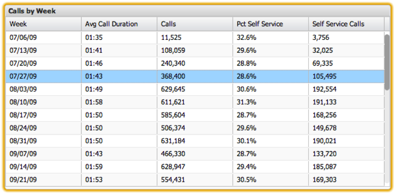

# 表 {#tables}

{{eol}}

表格是功能板应用程序中最为面向细节的可视化图表。 利用表格，可使用每个数据元素在表格中显示为一行来显示量度和维度数据。 一列保存维度值，而其他列包含相应的量度值。 可以显示多个量度，并且对表格中可显示的维度值数量没有限制。 Data Workbench数据中存在的选定维度的所有值都将显示在表中。

通过单击并拖动一个列标题到列标题区域中的其他位置，可以重新排列列顺序。 可以随时通过单击相应的列标题来执行排序。 再次单击列标题将反转排序顺序。

可通过单击特定行在表格中进行选择。 按住 **[!UICONTROL Control]** 键将在您单击其他项目时保留选择。 按住 **[!UICONTROL Control]** 键时，还会切换选定内容的值。 这对于仅从一组已选定项目中删除一个选择非常有用。 可通过以下方式选择行范围：先单击某行以将其选中，然后按 **[!UICONTROL Shift]** 键。

