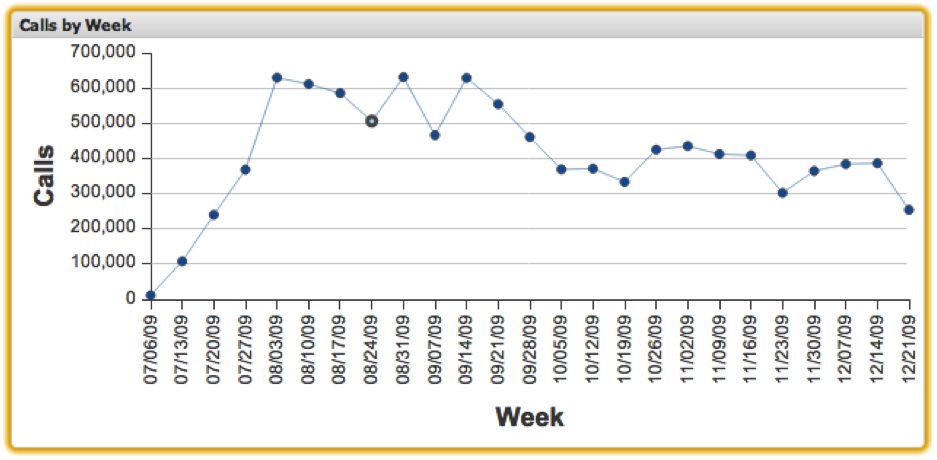

# 折线图{#line-charts}

折线图可视化允许您可视化度量和维度数据，每个数据元素表示为x-y轴上的一个点，以及连接相邻点的线。 折线图允许在图表上同时显示多达200个唯一数据元素。 维值沿x轴标记，度量增量沿y轴标记。 将鼠标放在折线图中的某个点上，将显示该点的确切度量值。

可通过单击特定点在折线图中进行选择。 按住Alt键将在您单击其他项目时保留选择。 单击时按住Alt键也可切换选区的值。 这对于仅从一组已选项目中删除一个选择很有用。

