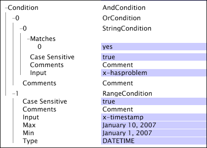

# 布尔运算{#boolean-operations}

{{eol}}

布尔运算合并测试运算的结果，测试运算用作布尔运算的子项。

有关测试操作的信息，请参阅 [测试运算](../../../../home/c-dataset-const-proc/c-conditions/c-test-ops/c-test-ops.md#concept-c4bf6cb9e7a94cc7ac49ca9b0b1a2144). 定义 [!DNL boolean] 操作时，您可以为操作定义零个或多个子项。

**向布尔运算中添加子条件**

1. 右键单击名称或与 [!DNL Boolean] 操作。
1. 单击 **[!UICONTROL Add new child]** 并选择可添加的条件类型之一。
1. 重复步骤1和2，直到您为 [!DNL Boolean] 操作。

   >[!NOTE]
   >
   >当您右键单击 [!DNL Boolean] 操作，你看 [!DNL Add new sibling] 菜单。 同级是条件层次结构中与 [!DNL Boolean] 操作。 为 [!DNL Boolean] 操作与通过右键单击 [!DNL Condition] 或 [!DNL Log Entry Condition] 参数。

**从布尔运算中删除子条件：**

1. 右键单击要从 [!DNL Boolean] 操作。
1. 单击 **[!UICONTROL Remove]** &lt;* **[!UICONTROL #number]***>，其中number是与要删除的子条件对应的数字。

本节讨论以下条件：

* [和](../../../../home/c-dataset-const-proc/c-conditions/c-test-ops/c-boolean-ops.md#section-a14dba4b07cc4ab9aeb20868f773db7c)
* [都不](../../../../home/c-dataset-const-proc/c-conditions/c-test-ops/c-boolean-ops.md#section-7e48b61266aa43ecbc48b979bf5e939b)
* [或](../../../../home/c-dataset-const-proc/c-conditions/c-test-ops/c-boolean-ops.md#section-a3aa0f56b6234f2680fa81939228326b)

## “逻辑与” {#section-a14dba4b07cc4ab9aeb20868f773db7c}

的 [!DNL And] 条件可以具有零个或多个子条件，并且当其子节点都未返回false时，该条件会返回true。

的 [!DNL And] 条件构成data workbench server中所有条件测试的根运算。 如果 [!DNL And] 条件不包含子项，条件的计算结果为true，并继续进行关联的运算。 这就是为什么只有 [!DNL And] 条件作为条件测试时，将始终执行该条件以及将该条件用作所有条件测试的根的原因。

此示例显示 [!DNL And] 条件用于确保 [!DNL Copy] 仅当日志条目的日期在2006年时，并且请求的页面是 [!DNL /products/purchase.asp].

## 都不 {#section-7e48b61266aa43ecbc48b979bf5e939b}

的 [!DNL Neither] 条件可以具有零个或多个子条件，如果其任何子条件的计算结果为true，则返回false。 如果 [!DNL Neither] 条件不包含子项，则其子项都无法返回true。 因此， [!DNL Neither] 条件的计算结果为true。

以下示例显示了 [!DNL Neither] 条件为两 [!DNL Range] 作为孩子的条件。 如所定义， [!DNL Neither] 条件不包括2007年1月1日至2007年1月10日之间或2007年1月12日至2007年1月14日期间发生的日志条目。 此类条件可用作 [!DNL Log Entry Condition] 用于在收集的数据存在已知问题的时段内从数据集中排除事务处理。

## 或 {#section-a3aa0f56b6234f2680fa81939228326b}

的 [!DNL Or] 条件可以具有零个或多个子条件，并且如果其至少一个子条件评估为true，则返回true。 如果 [!DNL Or] 条件不包含子项，则其子项都无法返回true。 因此， [!DNL Or] 条件的计算结果为false。

此示例显示 [!DNL Or] 条件 [!DNL String Match] 条件和 [!DNL Range] 条件。 的 [!DNL Or] 仅当日志条目具有 [!DNL x-hasproblem] 值设置为yes或日志条目发生在2007年1月1日到2007年1月10日的时间范围内。

