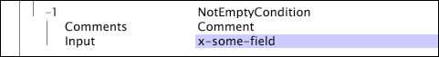

# 测试运算条件{#test-operation-conditions}

关于测试运算条件的信息，包括比较、不为空、范围、正则表达式和字符串匹配。

* [比较](../../../../home/c-dataset-const-proc/c-conditions/c-test-ops/c-test-op-con.md#section-fb2bdb3838504099b324b9838cdeeaac)
* [不为空](../../../../home/c-dataset-const-proc/c-conditions/c-test-ops/c-test-op-con.md#section-1decb9d887894073a1b6b3d985729ac8)
* [范围](../../../../home/c-dataset-const-proc/c-conditions/c-test-ops/c-test-op-con.md#section-1db31583bb09418b8f49481a897b08a6)
* [正则表达式](../../../../home/c-dataset-const-proc/c-conditions/c-test-ops/c-test-op-con.md#section-ae9c016502cb44128760c58f2d2d5297)
* [字符串匹配](../../../../home/c-dataset-const-proc/c-conditions/c-test-ops/c-test-op-con.md#section-f8d132085c6b4500bfbe4515b848142f)

## 比较 {#section-fb2bdb3838504099b324b9838cdeeaac}

The [!DNL Compare] condition compares string or numeric values. 对于字符串值的比较，可以指定是否应该考虑大小写。

The parameters of the [!DNL Compare] condition are described in the following table:

<table id="table_05B1FBB2AED242D99081E62BE2FBEC60"> 
 <thead> 
  <tr> 
   <th colname="col1" class="entry"> 参数 </th> 
   <th colname="col2" class="entry"> 描述 </th> 
   <th colname="col3" class="entry"> 默认 </th> 
  </tr> 
 </thead>
 <tbody> 
  <tr> 
   <td colname="col1"> Case Sensitive（区分大小写） </td> 
   <td colname="col2">true 或 false。仅当 Type（类型）为 LEXICAL（词法）时才使用。如果设为 false，则大写字母和小写字母被视为是等同的。 </td> 
   <td colname="col3"> true </td> 
  </tr> 
  <tr> 
   <td colname="col1"> 评论 </td> 
   <td colname="col2"> 可选。有关条件的说明。 </td> 
   <td colname="col3"> 评论 </td> 
  </tr> 
  <tr> 
   <td colname="col1"> Input A（输入 A） </td> 
   <td colname="col2"> 要比较的两个值中的第一个值。此值表示条件中的左操作数。 </td> 
   <td colname="col3"> </td> 
  </tr> 
  <tr> 
   <td colname="col1"> Input B（输入 B） </td> 
   <td colname="col2"> 要比较的两个值中的第二个值。此值表示条件中的右操作数。 </td> 
   <td colname="col3"> </td> 
  </tr> 
  <tr> 
   <td colname="col1"> Operation（运算） </td> 
   <td colname="col2"> 
比较运算。可用运算（及其含义）如下： 
     <ul id="ul_74F3C298E9CC4FE89897BA0052A9EB9F"> 
      <li id="li_1605FA73474E404A84056D40E7082623"> = 或 ==（输入 A 等于输入 B） </li> 
      <li id="li_F694A262ED7A4787B2A68B877339620C"> &lt;&gt; 或 !=（输入 A 不等于输入 B） </li> 
      <li id="li_1A75437E23B64BEB92297E1C771092B0"> &lt;（输入 A 小于输入 B） </li> 
      <li id="li_B80ED6BE9DEA41FE84BC6BA3B7759276"> &lt;=（输入 A 小于或等于输入 B） </li> 
      <li id="li_93148F34065F489E8E198DFB9F9F0E70"> &gt;（输入 A 大于输入 B） </li> 
      <li id="li_8A98EE9AED2445429805169040BB253D"> &gt;=（输入 A 大于或等于输入 B） </li> 
     </ul> 
 </td> 
   <td colname="col3"> = </td> 
  </tr> 
  <tr> 
   <td colname="col1"> 类型 </td> 
   <td colname="col2">要进行的比较类型。可用类型为 LEXICAL（词法）、NUMERIC（数值）和 DATETIME（日期时间）。有关这些类型的说明，请参阅 <a href="../../../../home/c-dataset-const-proc/c-conditions/c-test-ops/c-test-types.md#concept-a9fca97a2f03464cb0cbab8b5f809d0a"> 测试操作的测试类型</a>。 </td> 
   <td colname="col3">  LEXICAL（词法） </td> 
  </tr> 
 </tbody> 
</table>

此示例使用 [!DNL Compare] 条件来定义 [!DNL Log Entry Condition]。 在 Data Workbench Server 读取每条事件数据记录时，将比较数值 x-age 和 55。对于给定的日志条目，如果 x-age 小于等于 55，则该日志条目包含在数据集构建过程中。

## 不为空 {#section-1decb9d887894073a1b6b3d985729ac8}

The [!DNL Not Empty] condition checks a field to see if it contains a value or is empty. The condition is satisfied for any log entry whose value for the [!DNL Input] field is not empty.

The parameters of the [!DNL Not Empty] condition are described in the following table:

| 参数 | 描述 | 默认 |
|---|---|---|
| 评论 | 可选。有关条件的说明。 | 评论 |
| Input（输入） | 日志条目中用于检查内容的字段名称。 |  |

此示例采用 x-some-field 作为其输入并测试该字段是否为空。如果该字段填充了内容，则满足条件。

## 范围 {#section-1db31583bb09418b8f49481a897b08a6}

The [!DNL Range] condition takes an input field and determines whether the value of that field falls, inclusively, within the given minimum (Min) and maximum (Max) parameter values.

The parameters of the [!DNL Range] condition are described in the following table:

<table id="table_1587D8D333804FC28024C0DFC2F2D4D3"> 
 <thead> 
  <tr> 
   <th colname="col1" class="entry"> 参数 </th> 
   <th colname="col2" class="entry"> 描述 </th> 
   <th colname="col3" class="entry"> 默认 </th> 
  </tr> 
 </thead>
 <tbody> 
  <tr> 
   <td colname="col1"> Case Sensitive（区分大小写） </td> 
   <td colname="col2">true 或 false。仅当 Type（类型）为 LEXICAL（词法）时才使用。如果设为 false，则大写字母和小写字母被视为是等同的。 </td> 
   <td colname="col3"> true </td> 
  </tr> 
  <tr> 
   <td colname="col1"> 评论 </td> 
   <td colname="col2"> 可选。有关条件的说明。 </td> 
   <td colname="col3"> 评论 </td> 
  </tr> 
  <tr> 
   <td colname="col1"> Input（输入） </td> 
   <td colname="col2"> 日志条目中用作输入的字段名称。 </td> 
   <td colname="col3"> </td> 
  </tr> 
  <tr> 
   <td colname="col1"> Min（最小） </td> 
   <td colname="col2"> 
范围的下限。 
 
 此参数的值必须是一个文本值或字符串 - 而不是字段名称。如果对此字段使用日期，则必须指定时区。有关支持的时区缩写列表，请参阅 <a href="../../../../home/c-dataset-const-proc/c-time-zone.md#concept-9b540ec3e770490d94e9d5a985765477"> 时区代码</a>. 
 </td> 
   <td colname="col3"> </td> 
  </tr> 
  <tr> 
   <td colname="col1"> Max（最大） </td> 
   <td colname="col2"> 
范围的上限。 
 
 
注意：此参数的值必须是一个文本值或字符串 - 而不是字段名称。如果对此字段使用日期，则必须指定时区。有关支持的时区缩写列表，请参阅 <a href="../../../../home/c-dataset-const-proc/c-time-zone.md#concept-9b540ec3e770490d94e9d5a985765477"> 时区代码</a>. 
 
 </td> 
   <td colname="col3"> </td> 
  </tr> 
  <tr> 
   <td colname="col1"> 类型 </td> 
   <td colname="col2">要进行的比较类型。可用类型为 LEXICAL（词法）、NUMERIC（数值）和 DATETIME（日期时间）。有关这些类型的说明，请参阅 <a href="../../../../home/c-dataset-const-proc/c-conditions/c-test-ops/c-test-types.md#concept-a9fca97a2f03464cb0cbab8b5f809d0a"> 测试操作的测试类型</a>。 </td> 
   <td colname="col3"> </td> 
  </tr> 
 </tbody> 
</table>

此示例使用 [!DNL Range] 条件来定义 [!DNL Log Entry Condition]。 As the data workbench server reads each [!DNL event data] record, it compares the numeric values x-age and 55. 对于给定的日志条目，如果 x-age 至少为 55，则该日志条目包含在数据集构建过程中。This example performs the same function as the [!DNL Compare] condition example. 请参阅[比较](../../../../home/c-dataset-const-proc/c-conditions/c-test-ops/c-test-op-con.md#section-fb2bdb3838504099b324b9838cdeeaac)。

>[!NOTE]
>
>如果“最小”或“最大”参数留空，则Data Workbench Server将替换可用的最小或最大整数值。 最小值为零 (0)，最大值为无限大。

## 正则表达式 {#section-ae9c016502cb44128760c58f2d2d5297}

条件 [!DNL Regular Expression] 测试使用常规表达式模式匹配(请参 [阅常规表达式](../../../../home/c-dataset-const-proc/c-reg-exp.md#concept-070077baa419475094ef0469e92c5b9c))来确定指定输入字段的值是否包含与“匹配”参数中指定的模式之一匹配的字符串。

如果输入是字符串矢量，则只使用矢量中的第一个值进行测试。该条 [!DNL Regular Expression] 件执行完整字符串比较。 如果您要标识子字符串，则必须在字符串前后分别附加“.*”。

The parameters of the [!DNL Regular Expression] condition are described in the following table:

<table id="table_0BF5F89F87C9493B8DABA97620074FAD"> 
 <thead> 
  <tr> 
   <th colname="col1" class="entry"> 参数 </th> 
   <th colname="col2" class="entry"> 描述 </th> 
   <th colname="col3" class="entry"> 默认 </th> 
  </tr> 
 </thead>
 <tbody> 
  <tr> 
   <td colname="col1"> Case Sensitive（区分大小写） </td> 
   <td colname="col2"> true 或 false。如果设为 false，则大写字母和小写字母被视为是等同的。 </td> 
   <td colname="col3"> true </td> 
  </tr> 
  <tr> 
   <td colname="col1"> 评论 </td> 
   <td colname="col2"> 可选。有关条件的说明。 </td> 
   <td colname="col3"> 评论 </td> 
  </tr> 
  <tr> 
   <td colname="col1"> Input（输入） </td> 
   <td colname="col2"> 日志条目中用作输入的字段名称。 </td> 
   <td colname="col3"> </td> 
  </tr> 
  <tr> 
   <td colname="col1"> 匹配 </td> 
   <td colname="col2"> 
要匹配输入字段值的正则表达式模式。 
 
 <b> 添加正则表达式模式</b> 
     <ol id="ol_6D6467FF74334DEA8E8625C3B155D11D"> 
      <li id="li_9E13A63558FF44749C2E49BD50B7F770">右键单击匹配。 </li> 
      <li id="li_195A2F3B6B9442F5B1DACDE0FC96CE5C">单击新增 &gt; 正则表达式。 </li> 
      <li id="li_225E98F8EF39426A9483B86EA2CFE6DF">在文本框中输入所需的正则表达式。 </li> 
     </ol> 
 </td> 
   <td colname="col3"> </td> 
  </tr> 
 </tbody> 
</table>

This example illustrates the use of the [!DNL Regular Expression] condition to match a field of data collected from website traffic. The condition returns true only if the cs(referrer-query) field contains a string matching the regular expression `campaign=C[1-9][0-9]{4}`. 此正则表达式将匹配任何包含“campaign=C12345”的字符串。但是，该模式不匹配字符串“campaign=C0123&amp;”，因为“C”之后的第一个字符不在 1-9 的范围之内。

## 字符串匹配 {#section-f8d132085c6b4500bfbe4515b848142f}

条件 [!DNL String Match] 测试字符串等式。 它采用某个指定字段作为输入，测试每个日志条目中该字段的值是否与该运算的 Matches（匹配）参数中指定的字符串匹配。如果这些区分大小写的匹配字符串中有任何一个与所提供的输入字段中的值相同，则运算将返回 true。如果 [!DNL StringCondition] 不包含任何匹配字符串，则条件将返回 false。如果输入是字符串矢量，则只使用矢量中的第一个值（字符串）进行测试。

<table id="table_BD599BAA5DD54B278813B6C38AC8DE6B"> 
 <thead> 
  <tr> 
   <th colname="col1" class="entry"> 参数 </th> 
   <th colname="col2" class="entry"> 描述 </th> 
   <th colname="col3" class="entry"> 默认 </th> 
  </tr> 
 </thead>
 <tbody> 
  <tr> 
   <td colname="col1"> Case Sensitive（区分大小写） </td> 
   <td colname="col2"> true 或 false。如果设为 false，则大写字母和小写字母被视为是等同的。 </td> 
   <td colname="col3"> true </td> 
  </tr> 
  <tr> 
   <td colname="col1"> 评论 </td> 
   <td colname="col2"> 可选。有关条件的说明。 </td> 
   <td colname="col3"> 评论 </td> 
  </tr> 
  <tr> 
   <td colname="col1"> Input（输入） </td> 
   <td colname="col2"> 日志条目中用作输入的字段名称。 </td> 
   <td colname="col3"> </td> 
  </tr> 
  <tr> 
   <td colname="col1"> 匹配 </td> 
   <td colname="col2"> 
要匹配输入字段值的字符串。 
 
 <b>添加字符串</b> 
     <ol id="ol_9E32218C771445D88357960475FAD6EB"> 
      <li id="li_A700747858D0470491783E9B3933DAFE">右键单击匹配。 </li> 
      <li id="li_9D1A2462EA404B0F84426176737CAFED">单击新增 &gt; 字符串。 </li> 
      <li id="li_E84D2439B59548E5B1803C64A295A18E">在文本框中输入所需的字符串。 </li> 
     </ol> 
 </td> 
   <td colname="col3"> </td> 
  </tr> 
 </tbody> 
</table>

This example uses data collected from website traffic to illustrate the use of the [!DNL String Match] condition. The condition tests whether the input field (cs-uri-stem) matches either of the two strings specified in the Matches parameter, and it succeeds if the field cs-uri-stem is either the exact string [!DNL /navigation/footer.asp] or the exact string [!DNL /navigation/header.asp].

