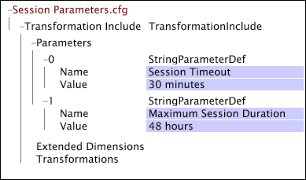

# 用于转换的特定于 Web 的设置{#web-specific-settings-for-transformation}

关于特定于 Web 的设置信息，这些设置在与 Adobe Site 配置文件一起提交的转换数据集包含文件中定义。

由这些设置定义的条件、维度和参数在数据集构建的转换阶段创建。

* [页面查看条件](../../../home/c-dataset-const-proc/c-config-web-data/c-web-spec-transf.md#section-cc2807a12a88492f8b64a43234a1f835)
* [URI 维度](../../../home/c-dataset-const-proc/c-config-web-data/c-web-spec-transf.md#section-348f7e9099d049d197a7cdcbc8a6c234)
* [反向链接维度](../../../home/c-dataset-const-proc/c-config-web-data/c-web-spec-transf.md#section-8a97ec34d18b4814b5f95495ac4f8638)
* [会话参数](../../../home/c-dataset-const-proc/c-config-web-data/c-web-spec-transf.md#section-0a209b0c504041a5801f7f71a963c8b1)

## 页面查看条件 {#section-cc2807a12a88492f8b64a43234a1f835}

[!DNL Page View Condition]是一个条件运算，用于确定收集的关于访客页面查看历史记录的数据中是否应包含特定日志条目（即页面请求）。 当日志条目满足[!DNL Page View Condition]时，它将成为“页面查看”可计数维度的元素。 如果日志条目不满足[!DNL Page View Condition]，则其数据字段仍可供其他维度访问。 除了“页面查看”维度之外，以下维度还可能会受到[!DNL Page View Condition]结果的影响：

* **[!DNL URI]和： [!DNL Page]** 这些维度直接受 [!DNL Page View Condition]影响。如果给定页面未传递[!DNL Page View Condition,]，则它不会包含在URI或页面维度中。

* **[!DNL Visitor Page Views]和 [!DNL Session Page Views]:** “访客页面查看次数”和“会话页面查看次数”维度是访客在给定会话中或在给定会话中查看的页面数量的计数。按[!DNL Page View Condition]过滤掉的页面不在此计数中。

* **会话编号：** 对“ [!DNL Page View Condition] 会话编号”维度具有间接影响。“会话编号”维度在[!DNL Page View Condition]之前创建；因此，在考虑与[!DNL Page Views]相关的[!DNL Session Number]时，可能会有不查看页面的会话。

[!DNL Site]的默认实施包括一个[!DNL Transformation Dataset Include]文件，其中定义了“页面查看”可计数维度和相关的[!DNL Page View Condition]。

有关可计数维度的信息，请参阅[扩展Dimension](../../../home/c-dataset-const-proc/c-ex-dim/c-abt-ex-dim.md)。

**编辑“页面查看条件”的配置设置**

1. 在数据集配置文件内打开[!DNL Profile Manager] ，然后打开[!DNL Dataset\Transformation\Traffic\Page View.cfg]文件。

   >[!NOTE]
   >
   >如果您已自定义[!DNL Site]的实施，则存在这些配置设置的文件可能与描述的位置不同。

1. 根据需要查看或编辑[!DNL Page View Condition]参数的值。 可参考以下示例。在此文件中，[!DNL Page View Condition]由[!DNL Copy]转换定义。 请注意，此文件还包含“页面浏览量”可计数维度的定义。

   

   >[!NOTE]
   >
   >有关可计数维度的信息，请参阅[扩展Dimension](../../../home/c-dataset-const-proc/c-ex-dim/c-abt-ex-dim.md)。 有关[!DNL Copy]转换的信息，请参阅[数据转换](../../../home/c-dataset-const-proc/c-data-trans/c-abt-transf.md)。

1. 右键单击窗口顶部的&#x200B;**[!UICONTROL (modified)]**&#x200B;保存文件，然后单击&#x200B;**[!UICONTROL Save]**。

1. 若要使本地所做的更改生效，请在[!DNL Profile Manager]列中右键单击[!DNL User]列中该文件的复选标记，然后单击&#x200B;**[!UICONTROL Save to]** > ***[!UICONTROL profile name]**>*，其中“配置文件名称”是数据集包含文件所属的数据集配置文件或继承配置文件的名称。

   >[!NOTE]
   >
   >请勿将已修改的配置文件保存到 Adobe 提供的任何内部配置文件中，因为当您安装这些配置文件的更新时，系统会覆盖您所做的更改。

## URI 维度 {#section-348f7e9099d049d197a7cdcbc8a6c234}

如果您要使用 [!DNL Site]，则需要定义 URI 维度，该维度的元素是所查看的网站页面的 URI 主干。您的默认实施包括一个[!DNL Transformation Dataset Include]文件，其中定义了URI简单维度。

有关简单维度的信息，请参阅[扩展Dimension](../../../home/c-dataset-const-proc/c-ex-dim/c-abt-ex-dim.md)。

**编辑 URI 维度的配置设置**

1. 在数据集配置文件内打开[!DNL Profile Manager] ，然后打开[!DNL Dataset\Transformation\Traffic\URI.cfg]文件。

   >[!NOTE]
   >
   >如果您已自定义[!DNL Site]的实施，则存在这些配置设置的文件可能与描述的位置不同。

1. 根据需要查看或编辑该文件参数的值。可参考以下示例和信息。

URI 维度的配置设置包含以下两个参数：

* **区分大小写：** True 或 false。如果为 true，则在识别唯一页面时会考虑字母的大小写情况。默认值为 true。
* **最大元素数量：** URI 维度元素（即 URI）的最大数量。默认值为 32768。

   >[!NOTE]
   >
   >更改此值可能会导致严重的性能问题。 在未咨询 Adobe 的情况下，请勿更改此值。

* 右键单击窗口顶部的&#x200B;**[!UICONTROL (modified)]**&#x200B;保存[!DNL URI.cfg]文件，然后单击&#x200B;**[!UICONTROL Save]**。

* 若要使本地所做的更改生效，请在[!DNL Profile Manager]列中右键单击[!DNL User]列中该文件的复选标记，然后单击&#x200B;**[!UICONTROL Save to]** > ***[!UICONTROL profile name]**>*，其中“配置文件名称”是数据集包含文件所属的数据集配置文件或继承配置文件的名称。

   >[!NOTE]
   >
   >请勿将已修改的配置文件保存到 Adobe 提供的任何内部配置文件中，因为当您安装这些配置文件的更新时，系统会覆盖您所做的更改。

## “反向链接”维度{#section-8a97ec34d18b4814b5f95495ac4f8638}

如果您要使用 [!DNL Site]，则需要定义“反向链接”维度，该维度的元素由所有会话中第一个日志条目反向链接的次级域组成。您的默认实施包括一个[!DNL Transformation Dataset Include]文件，其中定义了反向链接简单维度。

有关简单维度的信息，请参阅[扩展Dimension](../../../home/c-dataset-const-proc/c-ex-dim/c-abt-ex-dim.md)。

**编辑“反向链接”维度的配置设置**

1. 在数据集配置文件内打开[!DNL Profile Manager] ，然后打开[!DNL Dataset\Transformation\Traffic\Referrer.cfg]文件。

   >[!NOTE]
   >
   >如果您已自定义[!DNL Site]的实施，则存在这些配置设置的文件可能与描述的位置不同。

1. 根据需要查看或编辑该文件参数的值。可参考以下示例和信息。

   

   “反向链接”维度的配置设置包括 Maximum Elements（最大元素数量）参数，该参数指定“反向链接”维度元素（即反向链接）的最大数量。默认值为 32768。

   >[!NOTE]
   >
   >在上例中，[!DNL Maximum Elements]参数被设置为0。 此参数设为 0 时，Data Workbench Server 将使用其内部默认值 32768。

1. 右键单击窗口顶部的&#x200B;**[!UICONTROL (modified)]**&#x200B;保存[!DNL Referrer.cfg]文件，然后单击&#x200B;**[!UICONTROL Save]**。

1. 若要使本地所做的更改生效，请在[!DNL Profile Manager]列中右键单击[!DNL User]列中该文件的复选标记，然后单击&#x200B;**[!UICONTROL Save to]** > ***[!UICONTROL profile name]**>*，其中“配置文件名称”是数据集包含文件所属的数据集配置文件或继承配置文件的名称。

   >[!NOTE]
   >
   >请勿将已修改的配置文件保存到 Adobe 提供的任何内部配置文件中，因为当您安装这些配置文件的更新时，系统会覆盖您所做的更改。

## 会话参数 {#section-0a209b0c504041a5801f7f71a963c8b1}

如果您要使用 [!DNL Site]，则可以指定一些参数来定义网站上访客会话的边界。只有在[!DNL Site]实施的[!DNL Transformation Dataset Include]文件中定义这些参数时，这些参数才有效。

以下参数是唯一的，因为它们可以是[!DNL Transformation Dataset Include]文件[!DNL Parameters]矢量的成员，也可以作为[!DNL Transformation.cfg]文件中的单个参数列出。 一个参数只能定义一次，因此这些参数可在[!DNL Transformation.cfg]文件或数据集包含文件的[!DNL Parameters]矢量中定义，而不是在两个文件中定义。
**最大会话时长和会话超时**

Maximum Session Duration（最大会话时长）和 Session Timeout（会话超时）是用于定义访客会话长度的字符串参数。这些参数与 Internal Domains（内部域）参数结合使用来确定会话长度。

最大会话时长指定在启动新会话之前的最长会话长度。这可防止具有自动内容刷新功能的网页创建任意长度的会话。如果某个单击的反向链接设为 Internal Domains（内部域）参数中的条目之一，则此超时将用于定义会话结束。无论会话包含多少次单击，任何会话都不会长于指定的最大会话时长。建议的值为 48 小时。

会话超时指定在给定访客的日志条目之间需要经过的时间量，用于确定一个会话的结尾和新会话的开头（即用于定义用户会话的典型超时）。此参数的建议值是 30 分钟。如果某个单击的反向链接未设为 Internal Domains（内部域）参数中的反向链接之一，则此超时将用于定义会话。如果某个日志条目的 cs(referrer-domain) 位于内部域列表中，则“最大会话时长”将确定当前日志条目是现有会话的一部分还是新会话的开头。

假定某位访客在浏览网站期间被叫走，而且他离开计算机的这段时间长于“会话超时”。该访客返回后，从之前暂停的位置继续浏览。由于访客从未离开网站或关闭浏览器，因此他下一次单击的 cs(referrer-domain) 与内部域相同，并且只要未达到“最大会话时长”设置，他的原始会话就保持活动状态。如果网站的域列为内部域，并且未达到最大超时，则访客的交互会显示为一个会话，而不是两个不同的会话。但是，如果访客返回计算机后，他的下一次单击具有外部（或空白）反向链接，则会开始一个新会话。

>[!NOTE]
>
>[!DNL Sessionize]转换的[!DNL Timeout Condition]在确定访客会话的时长时也起着作用。 如果“会话超时”和“最大会话持续时间”不适用，则会检查[!DNL Timeout Condition]以确定是否应将日志条目视为新会话的开始。 有关更多信息，请参阅[数据转换](../../../home/c-dataset-const-proc/c-data-trans/c-abt-transf.md)。

**编辑 Maximum Session Duration（最大会话时长）和 Session Timeout（会话超时）参数**

如果您使用的是[!DNL Site]，则默认实施可能包含一个[!DNL Transformation Dataset Include]文件，其中指定了这些参数的名称和推荐值。

1. 在数据集配置文件中打开[!DNL Profile Manager]，然后转到[!DNL Dataset\Transformation\Traffic\Session Parameters.cfg]。

   >[!NOTE]
   >
   >如果您已自定义[!DNL Site]的实施，则定义这些参数的文件可能与描述的位置不同。

1. 根据需要编辑参数的值。请确保指定所需的单位（分钟、小时等）。

   

1. 右键单击窗口顶部的&#x200B;**[!UICONTROL (modified)]**&#x200B;并单击&#x200B;**[!UICONTROL Save]**&#x200B;保存[!DNL Session Parameters.cfg]文件。

1. 若要使本地所做的更改生效，请在[!DNL Profile Manager]列中右键单击[!DNL User]列中该文件的复选标记，然后单击&#x200B;**[!UICONTROL Save to]** > **[!UICONTROL profile name]**，其中“配置文件名称”是数据集包含文件所属的数据集配置文件或继承配置文件的名称。

   >[!NOTE]
   >
   >请勿将已修改的配置文件保存到 Adobe 提供的任何内部配置文件中，因为当您安装这些配置文件的更新时，系统会覆盖您所做的更改。

**[!DNL Internal Domains]**

[!DNL Internal Domains]（内部域）是一个矢量参数，它列出了应视为特定网站一部分的域级别主机（内部反向链接）。这些主机会从反向链接维度（外部反向链接信息的列表）中删除。如果 cs(referrer-domain) 匹配内部域集中列出的任何字符串，则会忽略“会话超时”，并且将使用“最大会话时长”确定会话长度。

当访客在一个公司的多个域（这些域以超过会话超时的方式关联在一起）之间转换时，Internal Domains（内部域）参数还可用于防止启动新会话。例如，假定公司的部分网站分为两个域：一个域进行记录 ([!DNL xyz.com])，另一个域不进行记录 ([!DNL xyz-unlogged.com])。如果这些网站的集成方式便于流量在两个域之间无缝移动，则每次访客从 [!DNL xyz-unlogged.com] 域转回 [!DNL xyz.com] 域时，便无需生成另一个会话。只要未达到“最大会话时长”设置，将 [!DNL xyz-unlogged.com] 列为内部域就能防止会话因为流量跨两个域而被拆分为多个会话。

**添加内部域**

如果您使用[!DNL Site]，则默认实施包含一个用于定义Internal Domains（内部域）参数的[!DNL Transformation Dataset Include]文件。 在此文件中，对该参数进行了命名，您只需输入想要包含的内部域并保存更新后的文件即可。

1. 在数据集配置文件中打开[!DNL Profile Manager]，然后转到[!DNL Dataset\Transformation\Traffic\Internal Domains.cfg.]

   >[!NOTE]
   >
   >如果您已自定义[!DNL Site]的实施，则定义Internal Domains（内部域）参数的文件可能与描述的位置不同。

1. 右键单击&#x200B;**[!UICONTROL Value]**（内部域矢量参数），然后单击&#x200B;**[!UICONTROL Add new]** > **[!UICONTROL Value]**。

1. 根据需要编辑值。

   

1. 右键单击窗口顶部的&#x200B;**[!UICONTROL (modified)]**&#x200B;并单击&#x200B;**[!UICONTROL Save]**&#x200B;保存[!DNL Internal Domains.cfg]文件。

1. 若要使本地所做的更改生效，请在[!DNL Profile Manager]列中右键单击[!DNL User]列中该文件的复选标记，然后单击&#x200B;**[!UICONTROL Save to]** > ***[!UICONTROL profile name]**>*，其中“配置文件名称”是数据集包含文件所属的数据集配置文件或继承配置文件的名称。

   >[!NOTE]
   >
   >请勿将已修改的配置文件保存到 Adobe 提供的任何内部配置文件中，因为当您安装这些配置文件的更新时，系统会覆盖您所做的更改。
