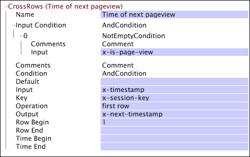

# CrossRows{#crossrows}

{{eol}}

与其他转换类似，CrossRows 转换也应用于日志源中的数据行（日志条目）。

对于每行数据，转换将获取指定输入字段的值，执行一组处理步骤，并将结果记录到指定的输出字段。但是，当 [!DNL CrossRows] 转换适用于一行数据（该行称为输出行），它会考虑该行以及与同一跟踪ID关联的一个或多个其他数据行（这些行称为输入行）。 因此，对于给定的跟踪ID，每个输出行的输出字段值基于一个或多个输入行的输入字段值。

该转换提供多个条件和约束，使您能够限制转换的输入行。您可以根据 Data Workbench Server 的条件（请参阅[条件](../../../../../home/c-dataset-const-proc/c-conditions/c-abt-cond.md)）、相对于输出行的输入行范围或相对于输出行时间的时间范围来表示这些限制。对于那些满足转换条件和约束的输入行，可以应用运算（如 SUM）来确定输出字段的值。

>[!NOTE]
>
>若要使用 [!DNL CrossRows] 转换，数据必须按时间排序并按源数据中的跟踪 ID 分组。因此， [!DNL CrossRows] 仅当在中定义时，才可使用 [!DNL Transformation.cfg] 文件或 [!DNL Transformation Dataset Include] 文件。

在查看下表中的参数描述时，请切记以下事项：

* 输出行是转换在给定的时间点处理的数据行。
* 输入行是其输入字段值用作转换输入的其他所有数据行（输出行之前、之后或包括输出行）。输入行由 Input Condition（输入条件）、Key（键）、Row Begin（开始行）、Row End（结束行）、Time Begin（开始时间）和 Time End（结束时间）参数决定。

<table id="table_152851484AFF4C50AF736DC62FAA43E3"> 
 <thead> 
  <tr> 
   <th colname="col1" class="entry"> 参数 </th> 
   <th colname="col2" class="entry"> 描述 </th> 
   <th colname="col3" class="entry"> 默认 </th> 
  </tr> 
 </thead>
 <tbody> 
  <tr> 
   <td colname="col1"> 名称 </td> 
   <td colname="col2"> 转换的描述性名称。可以在此处输入任何名称。 </td> 
   <td colname="col3"> </td> 
  </tr> 
  <tr> 
   <td colname="col1"> 评论 </td> 
   <td colname="col2"> 可选。有关转换的说明。 </td> 
   <td colname="col3"> </td> 
  </tr> 
  <tr> 
   <td colname="col1"> 条件 </td> 
   <td colname="col2"> 将转换输出限制到特定的日志条目。如果某个特定日志条目不满足条件，Output（输出）参数中的字段将保持不变。输入仍可用于影响其他日志条目。 </td> 
   <td colname="col3"> </td> 
  </tr> 
  <tr> 
   <td colname="col1"> Input（输入） </td> 
   <td colname="col2"> 输入行中用作输入的字段名称。 </td> 
   <td colname="col3"> </td> 
  </tr> 
  <tr> 
   <td colname="col1"> Input Condition（输入条件） </td> 
   <td colname="col2"> 仅从特定输入行接受转换的输入。如果某个特定输入行不满足输入条件，则将忽略来自该行的输入字段且不会影响其他输出行。但是仍将根据指定的条件修改来自该行的输出字段。 </td> 
   <td colname="col3"> </td> 
  </tr> 
  <tr> 
   <td colname="col1"> 键 </td> 
   <td colname="col2"> 
可选。用作键的字段名称。 
 
 如果指定了键，给定输出行的输入行会限制为与该输出行具有相同键值的连续行块。除此限制之外，CrossRows 转换的其他参数也对输入行施加了其他限制。 
 
 例如，如果您在处理 Web 数据并将字段 x-session-key（每个会话都有一个唯一的值）设为键，则转换的输入行会限制为那些与该输出行具有相同 x-session-key 值的行。因此，您考虑的只是那些表示页面查看与输出行发生在相同会话期间的输入行。 
 </td> 
   <td colname="col3"> </td> 
  </tr> 
  <tr> 
   <td colname="col1"> Operation（运算） </td> 
   <td colname="col2"> 
对于每个输出行，运算会应用于所有满足 Input Condition（输入条件）、Key（键）、Row Begin（开始行）、Row End（结束行）、Time Begin（开始时间）和 Time End（结束时间）参数定义的全部条件的输入行以生成输出： 
     <ul id="ul_C01CCF73A9544BCFB7B1105042FEF2DD"> 
      <li id="li_2D1A192970904499AB9F4431D51106D7"> ALL 从输入行中获取输入字段的所有值，并将它们作为矢量输出。 </li> 
      <li id="li_B8863724AD924DE5BDBC987143548257"> SUM 将输入行中输入字段的值解释为数字并对它们求和。 </li> 
      <li id="li_BF930069DCEA4E0B80893C3C06CAE100"> FIRST ROW 输出第一个输入行的输入字段值。 </li> 
      <li id="li_04B9E2D88C0847E28101FC830C18D8E2"> LAST ROW 输出最后一个输入行的输入字段值。 </li> 
     </ul> 
 </td> 
   <td colname="col3"> </td> 
  </tr> 
  <tr> 
   <td colname="col1"> 输出 </td> 
   <td colname="col2"> 输出字段的名称。 </td> 
   <td colname="col3"> </td> 
  </tr> 
  <tr> 
   <td colname="col1"> Row Begin/Row End（开始行/结束行） </td> 
   <td colname="col2"> 
可选。指定相对于输出行的输入行范围。例如，开始行的值为“0”将排除输出行之前的所有行。开始行的值为“1”还会排除输出行。常用范围包括： 
     <ul id="ul_B030F32A5146430BA50DD4FAB4A527B0"> 
      <li id="li_30DFB8C0265349C295943A1CB8077B86"> 开始 0：此行和后面的所有行。 </li> 
      <li id="li_9090C2E94E394351867BC5B78F27B41C"> 开始 1：后面的所有行。 </li> 
      <li id="li_F870DC913E3F45BA94EE2EC04D344DE0"> 结束 0：此行和前面的所有行。 </li> 
      <li id="li_B8A576E419744D84AB1298E5155B583E"> 结束 -1：前面的所有行。 </li> 
      <li id="li_CD2307A262D34542A2860FF07005CAD7"> 开始 -1，结束 -1：上一行。 </li> 
      <li id="li_6BF30B7BB7CC40A68B2332A3C11DD3B5"> 开始 1，结束 1：下一行。 </li> 
     </ul> 
 </td> 
   <td colname="col3"> 所有行 </td> 
  </tr> 
  <tr> 
   <td colname="col1"> Time Begin/Time End（开始时间/结束时间） </td> 
   <td colname="col2"> 
可选。指定相对于输出行时间的时间范围。例如，结束时间为“30 分钟”将包括在输出行之后 30 分钟内发生的所有行。开始时间为“-30 分钟”将包括在输出行之前 30 分钟内发生的所有行。 
 
 可用时间单位有天、周、小时、分钟、ms（毫秒）、ticks（100 纳秒）和 ns（纳秒）。 
 </td> 
   <td colname="col3"> 所有时间 </td> 
  </tr> 
 </tbody> 
</table>

此示例中的 [!DNL CrossRows] 转换应用于 Web 数据行，以查找每次页面查看的下一页面查看时间。由于我们知道，[!DNL CrossRows] 仅在数据集构建过程的转换阶段应用，因此数据行按访客（每个访客有一个唯一的跟踪 ID）和时间排序。

仅对那些填充了 x-is-page-view 字段的输入行（指示数据行表示一次页面查看）考虑输入字段 x-timestamp。为 Key（键）参数指定了 x-session-key 字段（每个会话都有一个唯一的值）。因此，转换的输入行（日志条目）限制为与输出行具有相同 x-session-key 值的连续行块。换句话说，若要考虑对某个输入行进行转换，该输入行必须表示与输出行中的页面查看发生在同一会话过程中的页面查看。第一行运算从满足 [!DNL Input] 条件，且其x-session-key值与输出行相同。

[!DNL CrossRows] 执行的时间量与其输入大小和输出大小之和成正比。这意味着，对于 SUM、FIRST ROW 和 LAST ROW 运算，其效率不低于其他转换。对于 ALL，情况更复杂一些，因为有可能配置 [!DNL CrossRows] 为每行数据（日志条目）输出一定的数据量，这些数据量与给定跟踪 ID 的总行数（日志条目）成正比。
