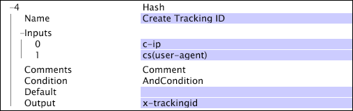

# Hash{#hash}

Hash 转换创建一个近乎唯一的字符串，表示一个来自输入值的 64 位数。

在给定相同输入时，此转换提供相同的散列值。

>[!NOTE]
>
>结果值几乎是唯一的，因为转换使用64位数作为可能的哈希值的空间。 对于 [!DNL hash] 转换的一百万次唯一输入，有 1/38,000,000 的机会获取重复散列值。

| 参数 | 描述 | 默认 |
|---|---|---|
| 名称 | 转换的描述性名称。可以在此处输入任何名称。 |  |
| 评论 | 可选。有关转换的说明。 |  |
| 条件 | 应用此转换的条件。 |  |
| 默认 | 在输入值不可用时所使用的默认值。 |  |
| Inputs（输入） | 用于创建散列值的输入集。 |  |
| Output（输出） | 输出字段的名称。 |  |

在此示例中，c-ip 和 cs(user-agent) 字段的值用于创建跟踪 ID，该跟踪 ID 存储在 x-trackingid 字段中。

>[!NOTE]
>
>此示例不代表创建唯一跟踪ID的理想解决方案。 但是，在使用存档日志信息的情况下，这可能是最佳方法。
