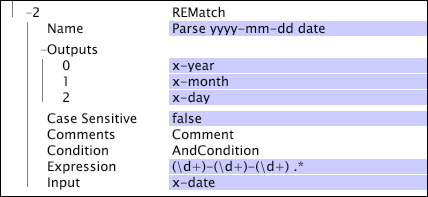

# REMatch{#rematch}

{{eol}}

REMatch 转换是一种模式匹配转换，该转换使用正则表达式指定一个或多个要在输入中查找和捕获的模式。

该转换为正则表达式中的每个捕获子模式构建一个输出字段。如果正则表达式不匹配输入字段，则输出将为空；如果输出字段已经存在，则值会替换为空值。有关使用正则表达式的简要指南，请参阅 [正则表达式](../../../../../home/c-dataset-const-proc/c-reg-exp.md#concept-070077baa419475094ef0469e92c5b9c).

>[!NOTE]
>
>的 [!DNL REMatch] 转换的操作方式与 [!DNL RETransform] 转换(请参阅 [RETransform](../../../../../home/c-dataset-const-proc/c-data-trans/c-transf-types/c-standard-transf/c-retransform.md#concept-23f80aa0bc204565b337e5c4931f6a74))，后者使用正则表达式捕获字符串并将该字符串存储在单个输出字段中。

[!DNL REMatch] 比多个字符串更有效地解析字符串 [!DNL RETransform] 转换或单个 [!DNL RETransform] 转换后跟 [!DNL Flatten] 转换。 请参阅 [Flatten](../../../../../home/c-dataset-const-proc/c-data-trans/c-transf-types/c-standard-transf/c-flatten.md#concept-7acd351a6d2444bd960ca412ae3333ce).

<table id="table_7077578512B249E986BC79AE770CBD9A"> 
 <thead> 
  <tr> 
   <th colname="col1" class="entry"> 参数 </th> 
   <th colname="col2" class="entry"> 描述 </th> 
   <th colname="col3" class="entry"> 默认 </th> 
  </tr> 
 </thead>
 <tbody> 
  <tr> 
   <td colname="col1"> 名称 </td> 
   <td colname="col2"> 转换的描述性名称。可以在此处输入任何名称。 </td> 
   <td colname="col3"></td> 
  </tr> 
  <tr> 
   <td colname="col1"> Case Sensitive（区分大小写） </td> 
   <td colname="col2"> true 或 false。指定匹配是否区分大小写。 </td> 
   <td colname="col3"></td> 
  </tr> 
  <tr> 
   <td colname="col1"> 评论 </td> 
   <td colname="col2"> 可选。有关转换的说明。 </td> 
   <td colname="col3"></td> 
  </tr> 
  <tr> 
   <td colname="col1"> 条件 </td> 
   <td colname="col2"> 应用此转换的条件。 </td> 
   <td colname="col3"></td> 
  </tr> 
  <tr> 
   <td colname="col1"> 表达式 </td> 
   <td colname="col2"> 用于匹配的正则表达式。 </td> 
   <td colname="col3"></td> 
  </tr> 
  <tr> 
   <td colname="col1"> Input（输入） </td> 
   <td colname="col2"> 计算正则表达式所针对的字段。 </td> 
   <td colname="col3"></td> 
  </tr> 
  <tr> 
   <td colname="col1"> Outputs（输出） </td> 
   <td colname="col2"> 
输出字符串或矢量的名称。如果字符串矢量作为输入，输出也将是字符串矢量。 
 
 表达式中的每个捕获子模式必须具有一个输出字段。 
 </td> 
   <td colname="col3"></td> 
  </tr> 
 </tbody> 
</table>

>[!NOTE]
>
>[!DNL REMatch] 转换可能会非常慢，并且可能会占用大量数据处理时间。

在此示例中，[!DNL REMatch] 转换将 YYYY-MM-DD 格式的日期解析为字段 x-year、x-month 和 x-day。对于日期 2007-01-02，x-year、x-month 和 x-day 的值将分别是 2007、01 和 02。

