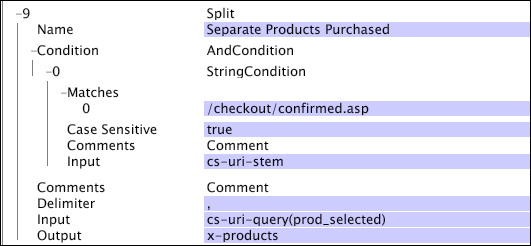

# 拆分{#split}

{{eol}}

Split 转换基于给定的分隔符将一个字符串拆分为子字符串矢量。

对于从与单个 URI 查询名称值关联的值集合中提取个别值而言，[!DNL Split] 尤其有用。

<table id="table_C97DA4E45DA844FAB8D61AABA22FF809"> 
 <thead> 
  <tr> 
   <th colname="col1" class="entry"> 参数 </th> 
   <th colname="col2" class="entry"> 描述 </th> 
   <th colname="col3" class="entry"> 默认 </th> 
  </tr> 
 </thead>
 <tbody> 
  <tr> 
   <td colname="col1"> 名称 </td> 
   <td colname="col2"> 转换的描述性名称。可以在此处输入任何名称。 </td> 
   <td colname="col3"> </td> 
  </tr> 
  <tr> 
   <td colname="col1"> 评论 </td> 
   <td colname="col2"> 可选。有关转换的说明。 </td> 
   <td colname="col3"> </td> 
  </tr> 
  <tr> 
   <td colname="col1"> 条件 </td> 
   <td colname="col2"> 应用此转换的条件。 </td> 
   <td colname="col3"> </td> 
  </tr> 
  <tr> 
   <td colname="col1"> 分隔符 </td> 
   <td colname="col2"> 
用于将输入字符串分隔为子字符串的字符串。必须为一个字符的长度。 
 
 如果按住 Ctrl 键并且右键单击 Delimiter（分隔符）参数内部，则会显示“插入”菜单。此菜单包含通常用作分隔符的特殊字符列表。 
 </td> 
   <td colname="col3"> </td> 
  </tr> 
  <tr> 
   <td colname="col1"> Input（输入） </td> 
   <td colname="col2"> 拆分其值以创建输出字符串矢量的字段名称。 </td> 
   <td colname="col3"> </td> 
  </tr> 
  <tr> 
   <td colname="col1"> 输出 </td> 
   <td colname="col2"> 输出字段的名称。 </td> 
   <td colname="col3"> </td> 
  </tr> 
 </tbody> 
</table>

请考虑这样一个网站，当客户访问与成功购买关联的确认页面时，客户购买的产品会作为 cs-uri-query 值的一部分列出。下面是此类字符串的一个示例：

* /checkout/confirmed.asp?prod_selected=B57481,C46355,Z97123

cs-uri-stem 字段用于确定日志条目请求的页面是否为确认页面。客户购买的产品代码作为 prod_selected 名称的逗号分隔值在 cs-uri-query 中列出。的 [!DNL Split] 如果cs-uri-stem的值与 [!DNL String Match] 条件。 请参阅[字符串匹配](../../../../../home/c-dataset-const-proc/c-conditions/c-test-ops/c-test-op-con.md#section-f8d132085c6b4500bfbe4515b848142f)。以下转换详细说明了这一问题的解决方案。

其中，输出字段是 x-products，该字段用于创建将购买的产品映射到购买会话所需的扩展维度。
