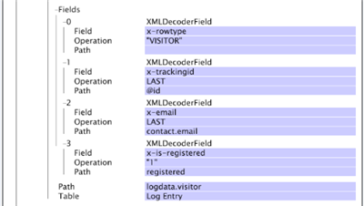

# XML 解码器组{#xml-decoder-groups}

{{eol}}

将XML文件处理为日志源，以定义解码器以从XML文件中提取数据。

>[!NOTE]
>
>为XML日志源定义XML解码器组需要了解XML文件的结构和内容、要提取的数据以及存储该数据的字段。 本节提供了您可以为解码器指定的参数的基本描述。您使用任何解码器的方式取决于包含源数据的 XML 文件。

有关 XML 日志源的格式要求信息，请参阅 [日志源](../../../../../home/c-dataset-const-proc/c-log-proc-config-file/c-log-sources.md#concept-6714c720fac044cbb9af003bf401b2ea). 在定义 XML 解码器时如需帮助，请联系 Adobe。

XML 解码器的顶级是解码器组 (XMLDecoderGroup)，这是一组用于从特定格式的 XML 文件提取数据的解码器表。如果您的 XML 文件格式各不相同，则必须为每种格式定义一个解码器组。每个解码器组都包含一个或多个解码器表。

下表描述了Tables（表）参数以及定义XML解码器组时必须指定的所有子参数。

<table id="table_06C40C5149E94548A1B0C2ED4397624B"> 
 <thead> 
  <tr> 
   <th colname="col1" class="entry"> 参数 </th> 
   <th colname="col2" class="entry"> 描述 </th> 
  </tr> 
 </thead>
 <tbody> 
  <tr> 
   <td colname="col1"> 表  </td> 
   <td colname="col2"> <p>解码器组中的每个表都表示一级要从 XML 文件中提取的数据。例如，如果您想要提取有关访客的数据，则需要创建一个解码器表，其中包含要对每个访客提取的信息。您还可以在解码器表内创建解码器表（请参阅 Children（子项））。 </p> <p> <b>向解码器组中添加表</b> 
     <ul id="ul_C73CAD77440B4465B9FCE08BF4FA0749"> 
      <li id="li_C4B8CC5A85D942898F1EB76778105818"> 右键单击<span class="uicontrol">表</span>，然后单击<span class="uicontrol">新增</span> &gt; <span class="uicontrol">XMLDecoderTable</span>。 </li> 
     </ul> </p> </td> 
  </tr> 
  <tr> 
   <td colname="col1"> Fields（字段） </td> 
   <td colname="col2"> <p>存储数据的扩展字段（例如 x-trackingid、x-email）。字段中存储的数据由“路径”和/或“运算”子字段确定。 </p> <p> “路径”是结构化的 XML 文件内的字段级别。字段路径对应于定义该字段的表路径。示例包括 <span class="filepath">tag.tag.tag</span> 或 <span class="filepath">tag.tag.tag.@attribute</span>。请注意，路径区分大小写。 </p> <p> “运算”应用于指定路径中的每一行以生成输出。可用运算如下： 
     <ul id="ul_B264A411D7E3446288E7E69D62150B8B"> 
      <li id="li_5936E81C0EEF46AFB780E451A04A88E4"><b>LAST：</b>字段获取路径在 XML 文件中最后一次出现的值。 </li> 
      <li id="li_7BC4F24F2CA84C2EB64B06FE09B4CAF6"><b>RANDOM：</b>为字段分配随机值。如果您需要生成唯一的 id（例如对于 x-trackingid 字段），则此运算非常有用。 </li> 
      <li id="li_C1D34EA11BFB4859A25A275A9B63FB56"><b>INHERIT</b>：定义的字段从父表的对应字段继承其值。 </li> 
      <li id="li_F62FB8CD962E4E1495D9A2D5B7A78E2A"><b>"<i>常量</i>"：</b>常量必须用引号引住。您可以使用常量运算来检查是否存在特定的路径；如果存在该路径，则为字段分配该常量的值。 </li> 
     </ul> </p> <p> <b>向解码器表中添加字段</b> </p> <p> 
     <ul id="ul_91D104D927424DEA9E788E43B2F6FEA9"> 
      <li id="li_5448B01EE82349569BBFC99C9604D7B8"> 右键单击<span class="uicontrol">字段</span>，然后单击<span class="uicontrol">新增</span> &gt; <span class="uicontrol">XMLDecoderField</span>。根据需要定义“字段”、“运算”和“路径”。 </li> 
     </ul> </p> </td> 
  </tr> 
  <tr> 
   <td colname="col1"> 路径 </td> 
   <td colname="col2"> <p>解码器表包含其信息的结构化 XML 文件内的级别。对于子 XML 解码器表，路径是相对于父表路径的。请注意，路径区分大小写。 </p> <p> 例如，如果 XML 文件包含以下结构： </p> 

    &amp;lt;visitor&amp;gt;
    
    &amp;nbsp;
    
    ...
    
    &amp;nbsp;
    
    &amp;lt;/visitor&amp;gt;
    
    &amp;lt;/logdata&amp;gt;&amp;nbsp; &lt;/code> &lt;p> 则路径为logdata&lt;span class=&quot;filepath&quot;>.visitor&lt;/span>。 &lt;/p> &lt;/td>
</tr> 
  <tr> 
   <td colname="col1"> Table（表） </td> 
   <td colname="col2"> <p>此参数的值应该始终为“日志条目”。 </p> <p> <p>注意：在未咨询 Adobe 的情况下，请勿更改此值。 </p> </p> </td> 
  </tr> 
  <tr> 
   <td colname="col1"> Children（子项） </td> 
   <td colname="col2"> <p>可选。一个或多个嵌入的解码器表。每个子项都包含上述的 Fields（字段）、Path（路径）和 Table（表）参数。 </p> <p> <b>向解码器表中添加子项</b> </p> <p> 
     <ul id="ul_902AC6CA5D66457D84CBA3194FF49BBE"> 
      <li id="li_07B4D60E7E2E4630B4878691E575936A"> 右键单击<span class="uicontrol">子项</span>，然后单击<span class="uicontrol">新增</span> &gt; <span class="uicontrol">XMLDecoderTable</span>。根据需要定义“字段”、“运算”和“路径”。 </li> 
     </ul> </p> </td> 
  </tr> 
 </tbody> 
</table>

若要将 XML 文件用作数据集的日志源，必须定义 XML 解码器组和表以提取要处理到数据集中的信息。在此示例中，您将了解如何为 Web 数据集的示例 XML 日志源定义解码器组和表。

以下XML文件包含有关网站访客的信息，包括Experience CloudID、电子邮件地址、物理地址以及有关访客页面查看次数的信息。


由于我们有一个 XML 文件，因此只需要一个解码器组，我们将该解码器组命名为“Sample XML Format”。此解码器组应用到与此文件具有相同格式的其他任何 XML 文件。若要开始在此解码器组内构建 XML 解码器表，我们必须首先确定要提取哪些信息以及将存储数据的字段。

在此示例中，我们提取有关访客以及与该访客相关的页面查看的信息。为此，我们创建包含访客相关信息的顶级（父）XML 解码器表，以及包含访客页面查看相关信息的嵌入（子）XML 解码器表。

**用于父（访客）表的信息如下所示：**

* XML 文件中每个数据行的数据类型标识符。我们使用 VISITOR 作为标识符，以便快速识别与访客（而不是页面查看）相关的数据行。我们可以将此值存储在 x-rowtype 字段中。
* 访客的 ID，我们将其存储在 x-trackingid 字段中。
* 访客的电子邮件地址 (contact.email)，我们将其存储在 x-email 字段中。
* 访客的注册状态。如果访客是已注册的用户，我们可以在 x-is-registered 字段中存储值“1”。
* 路径值为 [!DNL logdata.visitor]，且表值为 [!DNL Log Entry]. 有关这些参数的信息，请参阅上面的 XMLDecoderGroup 表。

**用于子（页面查看）表的信息如下所示：**

* XML 文件中每个数据行的数据类型标识符。我们使用 &quot;PAGEVIEW&quot; 作为标识符，以便快速识别与访客的页面查看（而不只是访客）相关的数据行。我们将此值存储在 x-rowtype 字段中。
* 访客的 ID。此值从父表中继承，并存储在 x-trackingid 字段中。
* 每次页面查看的时间戳，存储在 x-event-time 字段中。
* 每次页面查看的 URI，存储在 cs-uri-stem 字段中。
* “路径”值为 pageview，“表”值为“日志条目”。有关这些参数的信息，请参阅上面的 XMLDecoderGroup 表。

以下屏幕截图显示了 [!DNL Log Processing Dataset Include] 文件，其中根据父XML解码器表和子XML解码器表的讨论结构为示例XML文件生成XML解码器组。




为示例 XML 文件显示此解码器输出的表如下所示：

| x-rowtype | cs--uri-stem | x-email | x-is-registered | x-event-time | x-tracking-id |
|---|---|---|---|---|---|
| VISITOR |  | foo@bar.com | 1 |  | 1 |
| PAGEVIEW | /index.html |  |  | 2006-01-01 08:00:00 | 1 |
| 页面查看 | / |  |  | 2006-01-01 08:00:30 | 1 |

您可以在 Data Workbench 中使用字段查看器界面创建与上面类似的表。有关字段查看器界面的信息，请参阅 [数据集配置工具](../../../../../home/c-dataset-const-proc/c-dataset-config-tools/c-dataset-config-tools.md#concept-6e058b7691834cf79dcfd1573f78d4f5).

## 在XML元素#value用读取其属性值 {#section-88758428afb94f0baa5a986604d53bc1}

您现在可以使用 **[!DNL #value]** 标记，以提取XML元素的值。

例如，以前指定的路径为 **`<Hit><Page name="Home Page" index="20">home.html</Page></Hit>`** 使您无法读取 `<Page>` 标记。 读取 `<Page>` 标记及其属性，您可以 [!DNL Hit.Page.@name] 和 [!DNL Hit.Page.@index] 分别进行。 您还可以使用 **`Hit.Page.#value`** 表达式。

例如，您可以读取标记的值 `<varValue>` 通过在解码器中添加以下字段：

```
7 = XMLDecoderField: 
Field = string: x-varvalue-name-added 
Operation = string: LAST 
Path = string:  
<b>#value</b> 
Path = string: varValue 
Table = string: Log Entry
```

同样，您也可以读取标记的值 `<Rep>` 通过在解码器中添加以下字段：

```
7 = XMLDecoderField: 
Field = string: x-rep-name-added 
Operation = string: LAST 
Path = string: Rep.# 
<b>value</b> 
Path = string: Reps 
Table = string: Log Entry
```

相反，要读取无属性的元素标记的值，请 `<text>` 标记下 `<line>` 标记，且其值可通过提供“ [!DNL text]“ ”，或使用 [!DNL line.text]，具体取决于您构建解码器的方式。

```
2 = XMLDecoderField: 
Field = string: x-chat-text 
Operation = string: LAST 
Path = string:  
<b>text</b> 
Path = string:  
<b>line</b> 
Table = string: Log Entry
```
