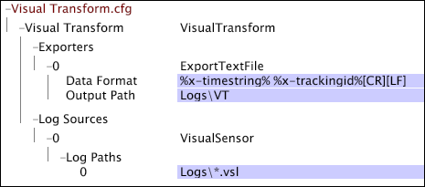

# Data Workbench Transform.cfg 示例文件{#sample-data-workbench-transform-cfg-files}

关于如何根据若干情景在 Transform.cfg 文件中指定参数的信息。

* [简单 Insight Transform.cfg 文件](../../../../../home/c-dataset-const-proc/c-transf-func/c-config-files-transf/t-ins-transf-file/c-sample-transf-files.md#section-b7e83cafa3a947c597bd09d316930190)
* [包含逗号分隔值的输出](../../../../../home/c-dataset-const-proc/c-transf-func/c-config-files-transf/t-ins-transf-file/c-sample-transf-files.md#section-03916934ad574efc8695abbae54a1816)
* [采样的日志文件](../../../../../home/c-dataset-const-proc/c-transf-func/c-config-files-transf/t-ins-transf-file/c-sample-transf-files.md#section-113b3b0c0c7547ea9536bb2f465c0875)
* [按网站区域拆分日志文件](../../../../../home/c-dataset-const-proc/c-transf-func/c-config-files-transf/t-ins-transf-file/c-sample-transf-files.md#section-2cac205cd3934d31abb6c6ed8780196d)

在每个示例中，文件都显示为 Data Workbench 中的 [!DNL Transform.cfg] 窗口。

## 简单的 Data Workbench Transform.cfg 文件 {#section-b7e83cafa3a947c597bd09d316930190}

以下[!DNL Transform.cfg]窗口提供了从[!DNL Logs]目录读取[!DNL .vsl]文件并将x-timestring和x-trackingid字段导出到Logs\VT目录中存储的文本文件的说明。 由于未指定文件旋转周期或输出文件名格式，因此每个文件都包含一个日历日的数据，并且其名称采用默认格式[!DNL %yyyy%%mm%%dd%-%x-mask%.txt]。

## 包含逗号分隔值的输出 {#section-03916934ad574efc8695abbae54a1816}

以下[!DNL Transform.cfg]窗口提供了从Logs目录读取[!DNL .vsl]文件并将字段0到13导出到存储在Logs\VT\CSV directory目录中以逗号分隔([!DNL .csv])文件的说明。 由于未指定文件旋转周期，因此每个文件都包含一个日历天的数据。输出文件是以[!DNL %yyyy%%mm%%dd%-%x-mask%.csv]格式命名的[!DNL .csv]文件。

## 示例日志文件 {#section-113b3b0c0c7547ea9536bb2f465c0875}

您可以配置转换功能，使其创建并维护完整日志文件的最新精简版本。这样做可让您快速测试数据集配置，只花几秒钟或几分钟时间便可完成重新处理，而不必耗用数小时来重新处理整个数据集。下面提供了如何配置转换功能以实现此操作的示例。

以下[!DNL Transform.cfg]窗口提供了从Logs目录读取[!DNL .vsl]文件并将x-timestring和x-trackingid字段导出到Logs\VT目录中存储的文本文件的说明。 指定的“哈希阈值”会从数据集中过滤特定的跟踪 ID，从而创建以 100 为系数采样的数据集。由于未指定文件旋转周期，因此每个文件都包含一个日历天的数据。输出文件的名称采用默认格式[!DNL %yyyy%%mm%%dd%-%x-mask%.txt]。

## 按网站区域拆分日志文件 {#section-2cac205cd3934d31abb6c6ed8780196d}

以下[!DNL Transform.cfg]窗口提供了从Logs目录读取[!DNL .vsl]文件并将x-timestring和x-trackingid字段导出到Logs\VT目录中存储的文本文件的说明。 正则表达式转换 ([!DNL RETransform]) 采用 cs-uri-stem 字段作为其输入，并创建定义网站区域的新字段 (x-site)。x-site 字段包含在输出文本文件的名称中，其中每个文件都包含一个日历天的数据。

