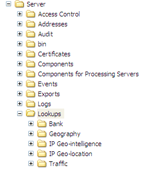

# 安装地理位置查找文件{#installing-the-geography-lookup-files}

在Data Workbench Server上安装地理位置查找文件的步骤。

随[!DNL Geography]用户档案提供的查找文件[!DNL (Lookups\Geography\DMA.txt]是一个双列制表符分隔的文本文件，用于列表DMA（指定市场区域）代码和相应的名称。

1. 从Adobe提供给您的[!DNL .zip]文件中打开Lookups文件夹。
1. 将Geography文件夹复制到Data Workbench Server安装目录中的Lookups文件夹。 你最终想得到……\Lookups\Geography folder on your data workbench server as shown in the following example。 “查找”文件夹中其他文件夹的名称可能与显示的文件夹名称不同。

   
