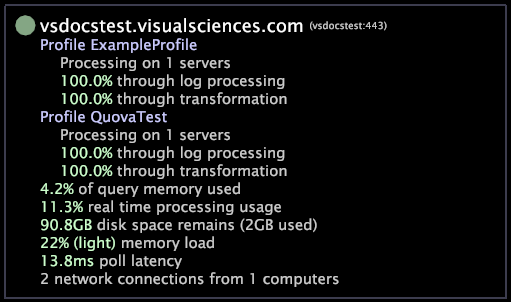

# Server Monitor interface{#server-monitor-interface}

服务器监视器界面可用于排除故障或仅跟踪作为Data Workbench服务器计算机客户端的Data Workbench服务器计算机和报表计算机的性能参数。

服务器监视器界面在计算机名称的左侧顶部显示一个绿色圆点或红色圆点。绿色圆点指示计算机工作正常，没有任何问题。红色节点指示计算机上出现了一个或多个错误。

服务器监视器界面比较靠下的部分列出了每个可用配置文件的处理状态，以及有关该计算机的性能详细信息。

For more information about [!DNL Data Workbench servers], see the *Server Products Installation and Administration Guide*. For more information about [!DNL Report], see the *Data Workbench Report Guide*.

**打开服务器监视器界面**

* 在“服务器管理器”中，右键单击Data Workbench服务器或计算机的节 [!DNL Report] 点。 t

单击 **[!UICONTROL Server Monitor]** 查看有关一台服务器的详细信息，或单击 **[!UICONTROL Related Servers]** > **[!UICONTROL Server Monitor List]** 查看有关相关服务器群集的详细信息。

The [!DNL Server Monitor]interface updates automatically every 10 seconds.

The following table lists the tasks that can be completed using the [!DNL Server Monitor] interface.

<table id="table_A65426669ADE44B5A6BAD9D4E99A5CAC"> 
 <thead> 
  <tr> 
   <th colname="col1" class="entry"> 若要执行此任务... </th> 
   <th colname="col2" class="entry"> 执行此操作... </th> 
  </tr> 
 </thead>
 <tbody> 
  <tr> 
   <td colname="col1"> 
检查配置文件的日志处理状态 
 </td> 
   <td colname="col2"> 
查看 Profile <i>配置文件名称</i>矢量。在以上示例中，通过查看 Profile ExampleProfile（配置文件 ExampleProfile）矢量，可以看到 ExampleProfile 配置文件在一个服务器上处理，并且其日志处理已 100% 完成。 
 </td> 
  </tr> 
  <tr> 
   <td colname="col1"> 
确定计算机响应请求所用的时间 
 </td> 
   <td colname="col2"> 
查看轮询延迟字段。如果该值大于 1000 毫秒，请联系 Adobe 支持服务部门。 
 </td> 
  </tr> 
  <tr> 
   <td colname="col1"> 
查看完成转换和查询大致所用的时间 
 </td> 
   <td colname="col2"> 
查看扫描时间 (hh:mm:ss) 字段，它仅在转换或查询过程中出现。 
 </td> 
  </tr> 
  <tr> 
   <td colname="col1"> 
确定计算机的当前网络连接数 
 </td> 
   <td colname="col2"> 
查看计算机的服务器监视器信息的最后一行。在以上示例中，您看到有 2 个网络连接当前来自一台计算机。 
 </td> 
  </tr> 
 </tbody> 
</table>

