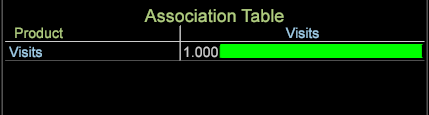

# 关联表可视化图表{#association-table-visualization}

{{eol}}

关联表格可视化让您能够借助 Cramer&#39;s V 算法，将量度与量度、维度和维度元素关联起来。

关联表格将值与 Cramer&#39;s V 计算结果相对比，而非使用[关联矩阵](https://experienceleague.adobe.com/docs/data-workbench/using/client/analysis-visualizations/correlation-analysis/c-correlation-analysis.html)和[关联弦图](https://experienceleague.adobe.com/docs/data-workbench/using/client/analysis-visualizations/c-chord-visualization.html)可视化中采用的皮尔逊关联系数（关联矩阵和关联弦图只能对比量度，而关联表格和[关联弦图](../../../home/c-get-started/c-analysis-vis/associations-chord.md#concept-51d0bda998474dd5946cc2a9b8393445)可以对比量度、维度和元素）。

## 构建关联表 {#section-87ed12ccc1af4196a1b6534e621c4cbb}

关联表格可以对计数或非计数维度的量度进行比较。表格可以修改，以便通过颜色选取在可视化中突出显示关联，或将其显示为文本图和/或热图。

1. 打开关联表格。

   右键单击 [!DNL Visualization] > [!DNL Predictive Analytics] > [!DNL Association Table].

   

1. 选择一个扩展维度 -“点进”、“点击”、“产品”、“访问”或“访客”维度。接着会打开一个关联表格，表格一角会指明该扩展维度，并在行和列中列出与之关联的量度。

   

   关联表格将 Cramer&#39;s V 作为对称相关，得出选定的量度、维度和元素值，同时反映在关联表格的列和行中。例如，选择 **产品** 扩展维度使用 **[!UICONTROL Visits]** 量度作为表行和列中的关联量度，因此会进行完美但无用的比较(1.00)，因为比较的值是相同的。

1. 向关联表格添加更多值。

   右键单击列或行，选择&#x200B;**添加量度**&#x200B;或&#x200B;**添加维度**。您还可以从&#x200B;**查找器**&#x200B;面板拖拽量度和维度。也可以从打开的表格将维度元素拖放到表格可视化。

   

   >[!NOTE]
   >
   >关联表中允许行和列数限制为10。
