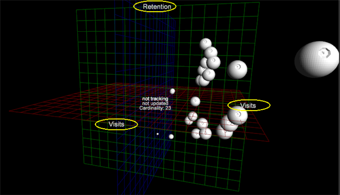

# 3D 散点图{#d-scatter-plots}

3D 散点图用三维网格绘制数据维度的元素（例如，“天数”或“推荐网站”），其中 x、y 和 z 轴表示各个量度。

与 [2D 散点图](https://docs.adobe.com/content/help/en/data-workbench/using/client/t-open-ins.html#Scatter_Plots)类似，在尝试了解使用不同量度的大量不同项目之间的关系时，这种可视化是非常有用的。

**要使用 3D 散点图可视化，请执行以下操作：**

1. 打开新工作区。

   打开新工作区以后，需要单击&#x200B;**添加** > **临时解锁**。
1. 右键单击并选择&#x200B;**可视化** > **3D 散点图**。

   将打开一个列有&#x200B;**[!UICONTROL Dimensions]**&#x200B;的菜单。

1. 选择一个维度用来查询。

   3D 散点图将打开该维度的默认量度。

   

   选择&#x200B;**[!UICONTROL Days]**&#x200B;菜单会在以下轴上显示以下3D散点图，其中包含这些默认量度：**[!UICONTROL x=Visits]**、**[!UICONTROL y=Retention]**&#x200B;和&#x200B;**[!UICONTROL z=Visits]**。

1. 更改量度。右键单击x、y或z轴中的量度标签，然后选择&#x200B;**[!UICONTROL Change Metric]**。 然后为选定的轴选择其他量度。

   

   >[!IMPORTANT]
   >
   >
   >    
   >    
   >    * 将某个量度拖到这三个轴标签之一，然后释放，这会将选定轴的量度更改为释放的量度。
   >    * 拖动可视化上任何其他地方的某个量度，然后释放，这会更改该轴的半径量度。
   >    * 将某个维度拖动到可视化上的任意位置，然后释放，这会更改该可视化的维度。

1. 更改半径量度。右键单击页面顶部的标题（在选定维度后带有标题），然后选择&#x200B;**[!UICONTROL Change Radius Metric]**。

   半径量度根据量度选择来定义标绘点的大小。点的相对位置在散点图中不会发生更改，但是可视化内的标绘点大小会根据量度值而增加。

   

1. 使用&#x200B;**[!UICONTROL Orthographic Camera]**。 此选项让您可以根据半径量度识别标绘点与各自真实透视的关系，从而避免三维变形。

   3D 散点图首次出现时，是显示在三维旋转投影中，会造成靠近透视或虚拟“相机”的标绘点出现变形。（靠近相机的点比离相机较远的点更大。）

   要避免此透视扭曲，可通过右键单击标题并从菜单中选择&#x200B;**[!UICONTROL Orthographic Camera]**&#x200B;选项。 此选项能够以二维模式表示三维对象。它能以平面模式呈现标绘点，并且相对于半径量度显示点，以减少三维偏移。

1. 从散点图选择点。

   * **要删除一个或一组点**：单击相应的点。
   * **要将另一个或另一组点添加到已选项**：按住 **Ctrl** + **单击**&#x200B;一个点，或按住 **Ctrl** + **拖选**&#x200B;多个点。

   * **要从已选项中删除一个或一组点**：按住 **Shift** + **单击**&#x200B;一个点，或按住 **Shift** **+** **拖选**&#x200B;多个点。

<!--  -->
