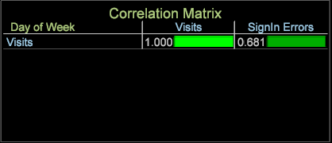

# 关联矩阵{#correlation-matrix}

统计关联测量有意义的关系，以便通过高级数据挖掘发现商机。

使用[Pearsons相关系数](../../../../home/c-get-started/c-analysis-vis/c-correlation-analysis/c-correlation-pearsons.md#concept-5996cb8c89fd4df5b47b7318e7a1d29c)，“相关矩阵”可为您提供相关信息以更好地识别营销活动中的后续步骤、改进网站设计或继续深入分析客户以获得其他相关依赖关系。

## 构建关联矩阵 {#section-87ed12ccc1af4196a1b6534e621c4cbb}

关联矩阵可以对计数或非计数维度的量度进行比较。矩阵随后可以进行修改，以便通过颜色选取在可视化中突出显示关联，或将其呈现为文本图和/或热图。

1. 打开关联矩阵。

   右键单击[!DNL Visualization] > [!DNL Predictive Analytics] > [!DNL Correlation Matrix]。 维度表将打开。

   

   从此菜单中选择维，如[!DNL Time] > [!DNL Day of the Week]。 关联表将打开，在矩阵角落标识维度，并在行和列中显示相关量度。对于“周”维度的“天”，**[!UICONTROL Visits]**&#x200B;是关联的量度。

   

   关联为 1.000，因为您是将一个量度与自身相比较（这样得到一个完美但无用的关联。）

1. 更改其中一个量度。

   右键单击并选择&#x200B;**[!UICONTROL Change Metric]**&#x200B;以更改行或列中的量度。 这会在两个量度值之间建立关联。

   在此示例中，将列中的&#x200B;**[!UICONTROL Visits]**&#x200B;量度更改为&#x200B;**[!UICONTROL Internal Searches]**。 右键单击并选择[!DNL Metric] > [!DNL Custom Events] > [!DNL Custom Event 1-10] > [!DNL Internal Searches]。

   

1. 向“关联矩阵”中添加更多量度。

   右键单击量度列或行。例如，从“量度”菜单中，添加  [!DNL Metric] >  [!DNL Custom Events] >  [!DNL Custom Event 1-10] >  [!DNL Sign in Error]。

   

   新量度将出现在列中并具有关联系数。您可以添加其他量度（如&#x200B;**[!UICONTROL Email Signups]**）来构建表。

   

   或向行添加量度，以与列中的量度做比较。

   

1. （可选）通过添加维度元素约束量度。

   在工作区中右键单击，然后选择&#x200B;**[!UICONTROL Table]**。 从打开的维度表中，按 Ctrl + Alt 并将元素拖放到列或行中的量度上。该元素将显示在相应量度旁边的括号内。

   例如，对于&#x200B;**[!UICONTROL Visits]**&#x200B;量度，可以通过选择&#x200B;**[!UICONTROL Country]**&#x200B;作为&#x200B;**[!UICONTROL New Zealand]**&#x200B;来限制它。

   

   注意：当您选择一个维度元素时，基于所选维度元素的所有量度的关联会发生改变。当维度窗口关闭以后，仅“访问次数”量度会受到“新西兰”的约束。

   >[!NOTE]
   >
   >如果更改具有维度约束的量度（通过右键单击并选择&#x200B;**[!UICONTROL Change Metric]**），则约束该量度的维度元素将丢失。 您需要重新添加维度元素。

1. 创建一个[二进制过滤器](../../../../home/c-get-started/c-analysis-vis/c-correlation-analysis/c-correlation-binary-filter.md#concept-24e1daff43c540f69019f236976da31c)，以进一步约束量度。右键单击表中的量度，然后从菜单中选择二进制过滤器。

## 关联规划和分析目标  {#section-cc322da60b7e417ba29e72b0afeb6f79}

以下是构建关联矩阵的一般目标。

**针对特定维度，识别两个量度之间的关系**。在此示例中，围绕核心维度“星期”构建了矩阵，并将量度“访问次数”、“电子邮件注册”和“登录错误”与“内部搜索”、“登录”和“显示的调查”量度事件进行了比较。

**提出假设以进行专门分析**。运行关联分析后，下一步便是探寻量度之间的依赖关系和关联性。例如，了解到内部搜索对电子邮件注册具有一定影响，这提供了一种途径来预测两者的关系，并据此修改营销活动或网站导航设计。

**识别量度以包含更多高级数据挖掘算法**。在大多数情况下，关键量度会因被发现对多个关联有影响而被识别出来。现在，您可以获得这些关键量度，并将它们应用到其他数据挖掘分析，以便获得更深见解。

## 关联矩阵功能说明  {#section-ef3626c665ea468a9ecdad624b4132f5}

**在表格中过滤和选择维度元素比较的是类值**。例如，使用“星期”维度，然后单击该核心维度的一个元素（例如单击“星期”维度表格中的某一特定日期），将会显示 100% 的一对一匹配度，这不会提供任何有用关联。由于根维度是“星期”，因此在“星期”维度表格中进行的任何选择都会将矩阵更改为一对一关联。

但是，仅在该特定日期时才会是一对一关联（一次选择所有元素时）。如果您选择多个元素，则不一定会保持一对一关联，而且无论选择一周中的一天还是多天，始终都不会产生 100% 匹配。

**统计关联不等于关联的数据模型**（Adobe Analytics 产品的历史参考）。Data Workbench 中的统计关联基于[皮尔逊关联模型](../../../../home/c-get-started/c-analysis-vis/c-correlation-analysis/c-correlation-pearsons.md#concept-5996cb8c89fd4df5b47b7318e7a1d29c)。

**在散点图中显示关联**。右键单击散点图上的标题，然后从[!DNL Visualization]菜单中选择[!DNL Display Correlation]。 关联值将显示在散点图的右上部分。

>[!NOTE]
>
>如果应用程序无法运行Pearsons关联计算，则散点图和Pearsons矩阵将显示“计算错误”。 这通常是由于数据不足，从而可能造成方程式的除数为零。
