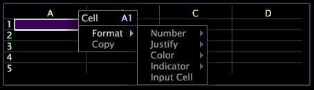

# Work with data in worksheets{#work-with-data-in-worksheets}

可以在工作表的任何单元格中输入文本或表达式。

All expressions in a worksheet are preceded by an equal sign (=) unless using [!DNL eval( )], which treats the text in the referenced cell as a expression.

For a full list of metric, dimension, and filter syntax rules, see [Query Language Syntax](../../../home/c-get-started/c-qry-lang-syntx/c-qry-lang-syntx.md#concept-15d1d3f5164a47d49468c5acb7299d9f).

**在工作表中键入数据**

1. 在电子表格中的某个单元格上单击两次可进入编辑模式。突出显示所选的单元格。
1. 在该单元格中键入或粘贴所需数据。

**从一个单元格复制并粘贴到另一个单元格**

1. Right-click the cell containing the data that you want to copy and click **[!UICONTROL Copy]**.
1. Right-click the cell into which you want to paste the copied data and click **[!UICONTROL Paste]**.

Data Workbench会自动更新新单元格中的引用以引用相应的列和行。

**从一组单元格复制并粘贴到另一组单元格**

1. 选择要复制的数据所在的单元格。
1. Right-click the cells containing the data that you want to copy and click **[!UICONTROL Copy]**.
1. Right-click the first cell into which you want to start pasting the copied data and click **[!UICONTROL Paste]**. 数据便会粘贴到第一个单元格及其下面的单元格。

Data Workbench会自动更新新单元格中的引用以引用相应的列和行。

**插入列**

* 右键单击列，然后单击 **[!UICONTROL Insert Column]**。 此时便会在所选列的左侧插入新列。

**删除列**

* Right-click the column that you want to delete and click **[!UICONTROL Delete Column]**. 此时该列便会被删除。

**插入行**

* 右键单击某行并单击 **[!UICONTROL Insert Row]**。 此时便会在所选行的上面插入新行。

**删除行**

* Right-click the row that you want to delete and click **[!UICONTROL Delete Row]**. 此时该行便会被删除。

**调整列大小**

1. 在列标题行中，将光标放在要更改其大小的列右侧的分界线上。
1. 单击并向右侧拖动以增加该列的宽度，或者向左侧拖动以减小该列的宽度。

**设置单元格格式**

1. Right-click the cell and click **[!UICONTROL Format]**.

   

1. 在可用选项的菜单中单击所需的格式：

<table id="table_5788E01E52CC44E7927A0D23760D9EDD"> 
 <thead> 
  <tr> 
   <th colname="col1" class="entry"> 菜单选项 </th> 
   <th colname="col2" class="entry"> 描述 </th> 
  </tr>
 </thead>
 <tbody> 
  <tr> 
   <td colname="col1"> 
数字 
 </td> 
   <td colname="col2"> 
对数据应用所选择的数字格式，如时间、日期、百分比或小数。 
 
单击默认可删除所选格式。 
 </td> 
  </tr> 
  <tr> 
   <td colname="col1"> 
两段对齐 
 </td> 
   <td colname="col2"> 
将单元格中的数据向左对齐、居中或向右对齐。默认的对齐方式是左对齐。 
 
单击默认可删除所选格式。 
 </td> 
  </tr> 
  <tr> 
   <td colname="col1"> 
颜色 
 </td> 
   <td colname="col2"> 
将所选的字体颜色应用于单元格中的数据。默认的字体颜色为白色。 
 
单击默认可删除所选格式。 
 </td> 
  </tr> 
  <tr> 
   <td colname="col1"> 
指示器 
 </td> 
   <td colname="col2"> 
使用该单元格创建量度指示器。有关详细信息，请参阅 <a href="../../../home/c-get-started/c-analysis-vis/c-wksts/c-metric-ind.md#concept-f0e911b23b2c4e8da3e1ea7b9ae04183"> 创建量度指示器</a>. 
 
单击默认可删除所选格式。 
 </td> 
  </tr> 
  <tr> 
   <td colname="col1"> 
输入单元格 
 </td> 
   <td colname="col2"> 
使所选单元格成为输入单元格。有关详细信息，请参阅<a href="../../../home/c-get-started/c-analysis-vis/c-wksts/c-input-cells.md#concept-08cd2c05a28a43dd9f7698b37e23e590">创建输入单元格</a>。 
 
单击默认可删除所选格式。 
 </td> 
  </tr> 
 </tbody> 
</table>

## 键盘快捷键 {#section-05301f4d2c60418e86902635a7aeee20}

在工作表中，您可以使用很多可在任何文本编辑器（如记事本或 Microsoft Word）中使用的基本编辑键盘快捷键。

下表列出了在工作表中输入数据时可以使用的基本键盘快捷键。

<table id="table_8E6F73F253B3451CA1DE45EE4F4E69EF"> 
 <thead> 
  <tr> 
   <th colname="col1" class="entry"> 快捷键 </th> 
   <th colname="col2" class="entry"> 描述 </th> 
  </tr> 
 </thead>
 <tbody> 
  <tr> 
   <td colname="col1"> 
箭头键 
 </td> 
   <td colname="col2"> 
使用上、下、左、右箭头键在工作表中从单元格移动到单元格。 
 </td> 
  </tr> 
  <tr> 
   <td colname="col1"> 
F2 
 </td> 
   <td colname="col2"> 
通过将光标放在所选的单元中来编辑单元格。 
 </td> 
  </tr> 
  <tr> 
   <td colname="col1"> 
Enter 
 </td> 
   <td colname="col2"> 
完成对所选单元格的编辑。从单元格中去除光标，此时单元格内容已反映出您的编辑。 
 </td> 
  </tr> 
  <tr> 
   <td colname="col1"> 
Esc 
 </td> 
   <td colname="col2"> 
取消对所选单元格的编辑。从单元格中去除光标，单元格内容还原为开始编辑之前的内容。 
 </td> 
  </tr> 
  <tr> 
   <td colname="col1"> 
删除 
 </td> 
   <td colname="col2"> 
删除单元格的内容。 
 </td> 
  </tr> 
  <tr> 
   <td colname="col1"> 
Ctrl+A 
 </td> 
   <td colname="col2"> 
选择单元格的内容。 
 </td> 
  </tr> 
  <tr> 
   <td colname="col1"> 
Ctrl+c 
 </td> 
   <td colname="col2"> 
复制单元格的内容。 
 </td> 
  </tr> 
  <tr> 
   <td colname="col1"> 
Ctrl+x 
 
Shift+Delete 
 </td> 
   <td colname="col2"> 
复制并删除单元格的内容。 
 </td> 
  </tr> 
  <tr> 
   <td colname="col1"> 
Ctrl+v 
 
Shift+Insert 
 </td> 
   <td colname="col2"> 
将复制的单元格内容粘贴到所选单元格中。 
 </td> 
  </tr> 
  <tr> 
   <td colname="col1"> 
Ctrl+z 
 </td> 
   <td colname="col2"> 
撤消键入。 
 </td> 
  </tr> 
  <tr> 
   <td colname="col1"> 
Ctrl+Shift+z 
 </td> 
   <td colname="col2"> 
恢复键入。 
 </td> 
  </tr> 
 </tbody> 
</table>

