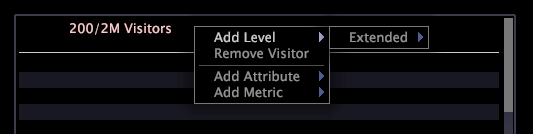

# 详细信息表{#detail-table}

明细表可用于查看有关某个数据子集（通过在其他可视化中进行选择来定义）的其他信息。

您看到的其他信息就是所有可用数据的抽样。

下表介绍明细表的元素。

<table id="table_C88C7F7F5AEA4820B908923E45CC0A62"> 
 <thead> 
  <tr> 
   <th colname="col1" class="entry"> 元素 </th> 
   <th colname="col02" class="entry"> 颜色 </th> 
   <th colname="col2" class="entry"> 描述 </th> 
  </tr> 
 </thead>
 <tbody> 
  <tr> 
   <td colname="col1"> 
级别 
 </td> 
   <td colname="col02"> 
粉红色 
 </td> 
   <td colname="col2"> 
要查看其详细属性和量度信息的任何可计数维度。级别前面是所显示的元素数与可用元素数的比，例如 6/444 表示在可能的 444 个元素中正在显示的元素数为 6。在上面的示例中，级别“访客数”表示提供的所有详细信息都基于访客。级别“页面查看次数”表示提供的所有详细信息都基于页面查看。当您要分析具有不同可计数父级的数据时，同时查看多个级别非常有用。 
 </td> 
  </tr> 
  <tr> 
   <td colname="col1"> 
属性 
 </td> 
   <td colname="col02"> 
绿色 
 </td> 
   <td colname="col2"> 
与级别具有一对多或一对一关系的任何维度，如“城市”到“访客数”。每一行都显示与所选择的级别的每个元素有关的元素。在上面的示例中，“域”和“城市”属性列出了每个示例访客所在的域和城市。 
 </td> 
  </tr> 
  <tr> 
   <td colname="col1"> 
量度 
 </td> 
   <td colname="col02"> 
蓝色 
 </td> 
   <td colname="col2"> 
有关所选择的级别的量度详细信息。在上面的示例中，级别设置为“访客数”，量度“页面查看次数”显示单个访客的页面查看次数，而“页面查看次数”级别提供有关这些页面查看次数的详细信息。 
 </td> 
  </tr> 
 </tbody> 
</table>

例如，您在使用网站数据时想计算在特定时间段内属于特定城市且来自特定域的访客都访问了哪些页面。

首先，您需要创建一个显示您感兴趣的时间段的可视化，然后您需要选择该时间段。此时，您可以添加明细表，以查看数据集中示例数量的访客的所需详细信息。

若要查看上述详细信息，必须完成以下步骤：

1. 右键单击详细信息表，然后单击&#x200B;**[!UICONTROL Add Level]** > **[!UICONTROL Visitor]**。
1. 右键单击详细信息表，然后单击&#x200B;**[!UICONTROL Add Level]** > **[!UICONTROL Page View]**。
1. 右键单击&#x200B;**[!UICONTROL Visitors]**&#x200B;级别标题，然后单击&#x200B;**[!UICONTROL Add Attribute]** > **[!UICONTROL Geography]** > **[!UICONTROL Domain]**。
1. 右键单击“访客”级别标题，然后单击&#x200B;**[!UICONTROL Add Attribute]** > **[!UICONTROL Geography]** > **[!UICONTROL City]**。
1. 右键单击“访客”级别标题，然后单击&#x200B;**[!UICONTROL Add Metric]** > **[!UICONTROL Page Views]**。
1. 右键单击“页面查看次数”级别标题，然后单击&#x200B;**[!UICONTROL Add Attribute]** > **[!UICONTROL Page]** > **[!UICONTROL Page]**。

以下示例工作区显示了在您指定的时间段内随机抽取的访问网站的 6 个访客的相关详细信息。

## 添加级别{#section-f948d3361fd84906ac4d9ebce520bfd0}

* 右键单击明细表，然后单击&#x200B;**[!UICONTROL Add Level]** > *&lt;**[!UICONTROL dimension name]**>*。

## 删除级别{#section-a8c820e0b656451e98e5ea75373edefc}

* 右键单击现有级别标题，然后单击&#x200B;**[!UICONTROL Remove Level]** > *&lt;**[!UICONTROL dimension name]**>*。

## 添加属性和量度{#section-cdda2df3c9a448d5b9770686c8b8efb3}

* 右键单击属性或量度标题，然后单击&#x200B;**[!UICONTROL Add Attribute]** > ***[!UICONTROL attribute name]**>*&#x200B;或&#x200B;**[!UICONTROL Add Metric]** > ***[!UICONTROL metric name]**>*。

## 删除属性和量度{#section-4002ac957a2846678f9940270987d651}

* 右键单击要删除的列，然后单击&#x200B;**[!UICONTROL Remove Attribute]** > ***[!UICONTROL attribute name]**>*&#x200B;或&#x200B;**[!UICONTROL Remove Metric]** > ***[!UICONTROL metric name]**>*。

## 导出到 Microsoft Excel {#section-a9eaba63c88a4598836a34669ba8cac1}

有关导出窗口的信息，请参阅[导出窗口数据](../../../home/c-get-started/c-wk-win-wksp/c-exp-win-data.md#concept-8df61d64ed434cc5a499023c44197349)。
