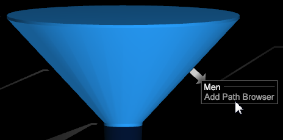

# 添加路径浏览器{#adding-a-path-browser}

从漏斗可视化中，您可以打开“路径浏览器”以识别访客流失和途经路径的额外详细信息。

<!--  -->

您可以识别访客“流失”（离开路径）或访客“途经”（遵循路径）的位置。通过选择流失箭头或途经圆锥，可以从同一漏斗可视化中打开多个路径浏览器。

1. 打开流失访客（在特定步骤期间离开网站的访客）的路径浏览器。右键单击流失箭头并选择“添加路径浏览器”选项。

   

   从路径浏览器中，您可以看到访客在点击漏斗中选定元素之前去过哪里（位于左侧），以及离开页面之后导航至何处（位于右侧）。

   

   在路径浏览器视图中，进入或离开选定维度的线条宽度标识流量大小。例如，点击“男士”页面之前，一些访客通过其他路由进入，而大多数访客从主页进入。离开时，大多数访客前往“男士冲浪衣”页面。

1. 打开“途经”访客的路径浏览器。右键单击漏斗中的圆锥以识别途经（或移至漏斗的下一个步骤）访客的路径。
1. 单击路径浏览器视图底部的&#x200B;**更多**&#x200B;按钮，打开一个表格，其中以表格视图列出了以前和当前访问的所有访问。

   
