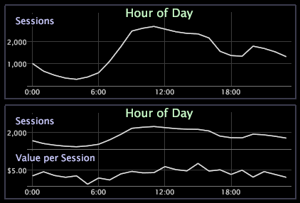

# 添加和更改量度{#add-and-change-a-metrics}

{{eol}}

添加新量度或更改量度的步骤。

以下示例显示在“时间（小时）”维度上绘制的“会话数”量度（上面的折线图），以及向左轴中添加了另一个量度“每个会话的值”的相同折线图（下面的折线图）。

**添加新量度**

* 右键单击量度的元素或标签，然后单击 **[!UICONTROL Add Metric]** > *&lt;**[!UICONTROL metric name]**>*. 此时该量度会添加到您最初选择的量度下面。

**更改量度**

* 右键单击要更改的量度的元素或标签，然后单击 **[!UICONTROL Change Metric]** > *&lt;**[!UICONTROL metric name]**>*. 新量度会替换原始量度。
