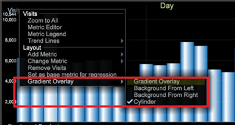

# 更改图形显示{#change-a-graph-display}

默认情况下，图表可视化显示条形图，但您可以轻松将条形图显示为折线图，反之亦然。

以下示例中显示了这两种显示类型。

**选择显示类型**

右键单击图形底部的维度标签，然后单击&#x200B;**[!UICONTROL Display]** > **[!UICONTROL Draw lines]**&#x200B;或&#x200B;**[!UICONTROL Display]** > **[!UICONTROL Draw bars]**。 此时会在活动的显示模式左侧显示一个 X。

**图表上的渐变叠加**

您可以右键单击并从菜单中选择&#x200B;**渐变叠加**，以便更好地查看图表元素。

* **没有渐变叠加**。选择此项可显示没有应用渐变叠加的条形图。
* **左入背景**&#x200B;选择此项可在所有条形图中从左至右渐变色彩。
* **右入背景**&#x200B;选择此项可在所有条形图中从右至左渐变色彩。
* **圆柱体**。选择此项可从每个条形图的中心位置向边缘渐变色彩。
