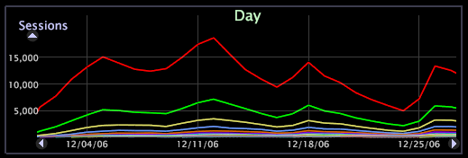

# 更改系列{#change-a-series}

{{eol}}

在折线图中可以对某个维度中的元素以系列的形式进行颜色编码，以便可以跨工作区中的其他可视化更加轻松地跟踪每个元素。

仅当折线图显示为线条而不是栏时，才能对图表应用系列功能。

当某个系列处于活动状态时，采用交替的颜色显示维度中不同元素的数据。这对于向工作区（该工作区显示相同的维度以为所选维度提供系列图例）中添加表格是非常有用的。请参阅[使用系列图例](../../../../home/c-get-started/c-analysis-vis/c-tables/c-srs-leg.md#concept-c48042a705524bc4b63cd6f24874cc12)。

**启用系列**

* 右键单击维度的元素或标签，然后单击 **[!UICONTROL Change Series]** > *&lt;**[!UICONTROL dimension name]**>*.

**禁用系列**

* 右键单击维度的元素或标签，然后单击 **[!UICONTROL Change Series]** > **[!UICONTROL None]**.
