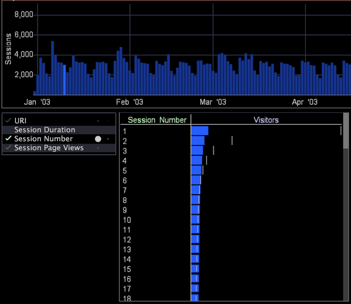

# 统计对策{#statistical-measures}

为了帮助进行统计，Data Workbench在引导式分析可视化中提供了三种统计指标。

>[!NOTE]
>
>尽管数学可以帮助您判断数据中的关联性，但数据的相关背景也必须得到考虑。

* **Chi Sq p** 是统计显著性测试，它控制可视化中复选标记的出现。从数学上讲，我们有可能会拒绝零假设，该假设认为在两个组之间观察到的差别可以由随机变差来解释。实际上，如果 Chi Sq p 值差不多小于 100%，我们就可以忽略相关性，而不管它测量的相关程度如何（如以下 U 统计量和 V 统计量部分所述）。
* **U 统计量**&#x200B;是统计相关性相关程度的指标。从数学上讲，它来自信息理论这一数学分支，与两个组的分布之间的交互信息概念紧密相关。或者，也可以将其认为是为一个组提供最佳编码方案的另一个组的可压缩性。实际上，该指标在维度具有包含很少访客的很多元素时通常执行得不错。该指标在 0（弱）到 1（强）之间变化。
* **V 统计量**&#x200B;也是统计相关性相关程度的指标。从数学上讲，它与我们熟悉的 Cramer’s V 统计量有关，唯一的差别是为了提高该指标关于选择倒置的对称性而进行的一个标准化步骤。实际上，该指标非常适合很多类型的维度并且与常用的统计指标有关。该指标在 0（弱）到 1（强）之间变化。

>[!NOTE]
>
>选择U和V统计数据以相互补充，每个统计数据都调整为检测其他数据可能没有强烈响应的关联类型。

使用该可视化作为指南，您可以向工作区中添加其他可视化，以根据选择提供对数据的更详细的洞察。

以下 [!DNL Site] 示例包含一个条形图，该图显示了 1 月、2 月、3 月和 4 月的会话数。请注意，已选择 1 月的某一天。

位于工作区左下角的指导分析可视化指出“会话数量”维度提供有关所选日期的有用信息。

通过检查位于工作区右下角的“会话数量”条形图，您可以看出会话数量 2 更低于基准。因此，我们得出结论，在所选择的日期上发生会话数量为 2 的会话的百分比低于往常。若要查看在指导分析可视化中列出的任何维度的条形图，只需通过鼠标单击该维度来选择维度。
