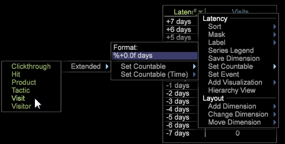

# 延迟分析{#latency-analysis}

{{eol}}

在某个营销活动或其他类型的事件发生后，或者在某段时间之后，延迟可视化允许您分析在某个事件发生前后的一定天数内潜在客户的行为。

的 **[!UICONTROL Latency]** 可视化允许您设置一个量度来识别事件发生之前、期间或之后的行为，以确定它对客户行为的影响。 例如，您可以通过查看事件发生后一周的收入来确定营销活动的效果。或者，您也可以显示事件发生前一周的客户行为，以将其作为一个基准来衡量事件对行为产生的效果。

使用延迟可视化时，您可以将时间维度从天、小时、周或其他时段更改为访问、点进、点击或其他可计数的维度。

**设置延迟分析**

1. 打开工作区并右键单击 [!DNL Visualization] > [!DNL Latency].

1. 从菜单中，选择要分析延迟事件的天数。 

1. 右键单击 **[!UICONTROL Latency]** 标签以打开菜单。

   * 使用 **[!UICONTROL Set Countable]** 选项，请设置可计数的维度，例如访问、点进、点击等。
   * 使用 **[!UICONTROL Set Countable (Time)]** 选项，设置时间维度，如天、小时、周、星期和小时。

   

1. 修改延迟可视化。

   右键单击 **[!UICONTROL Latency]** 标题，用于选择菜单选项以更改可计数、维度、重新标签或选择或更改其他设置。
