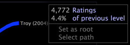

# 路径浏览器{#path-browsers}

{{eol}}

路径浏览器可用于分析访问某个特定维度的元素的顺序。

通过将维度的元素拖放到空白路径浏览器可视化上，可以创建路径浏览器。您拖放到路径浏览器上的元素会成为该路径浏览器的根。路径浏览器显示通过该根的路径，从而您可以看到在该根前后访问的元素顺序。

以下路径浏览器显示在给影片 *The Aviator*（它是路径浏览器的根）打分前后观看者为其打分的影片顺序。每个影片名称都是“影片”维度的一个元素，该维度是在包含影片数据（包括影片的名称以及这些影片的观看者的打分）的数据集中定义的。

可以创建路径浏览器，以显示访问数据集中任何维度的元素的顺序。例如，如果您使用网站数据，则可以创建一个路径浏览器，以显示每个会话（在该会话中查看根）或每个网站访客（该访客查看根）在根前后访问的网站页面的顺序。

每个路径浏览器都具有关联的基本维度、组维度、级别维度和量度，它们为解释在路径浏览器中显示的数据提供关键信息。

* **基本维度：**&#x200B;当您将根元素拖放到路径浏览器上时，您拖放的便是基本维度的元素。路径中出现的所有其他元素都是该基本维度的元素。可以通过将其他维度的元素拖放到路径浏览器上来更改基本维度。
* **级别维度：**&#x200B;数据集中的每个维度都具有关联的级别维度（也称为父维度）。路径浏览器的级别维度应该与路径浏览器的基本维度的级别维度（或父维度）相同。路径浏览器的级别维度非常重要，其原因主要有两个：

   * 当您沿一条路径从一个基本维度元素到下一个基本维度元素时，便从一个级别维度元素移动到下一个级别维度元素。例如，假设您创建了一个显示网站页面的路径浏览器。每个页面都是“页面”维度的一个元素，并且“页面”的级别维度为“页面查看”。当您从一个页面移动到下一个页面时，您便从一次页面查看移动到了下一次页面查看。
   * 当您在路径浏览器中选择基本维度元素的某个路径时，您便是为级别维度的相应元素选择数据。该选择始终包括与根相关的级别维度的元素，并且可以通过向路径添加其他元素加以完善。例如，当您选择某个页面路径（如根 > A > B）时，您便是为与该根（下一个页面为 A，再下一个页面为 B）关联的页面查看次数选择数据。

      有关在路径浏览器中选择路径的信息，请参阅 [选择路径](../../../../home/c-get-started/c-analysis-vis/c-path-browsers/t-sel-paths.md#task-bf44d08c71954ef2adec4b82f840adeb). 有关选择的信息，请参阅 [在可视化中进行选择](../../../../home/c-get-started/c-vis/c-sel-vis/c-sel-vis.md#concept-012870ec22c7476e9afbf3b8b2515746).
   >[!NOTE]
   >
   >路径浏览器忽略级别维度的元素，而没有关联的基本维度元素。 当您从流程图创建一个路径浏览器时可能会发生这种情况。请参阅 [创建路径浏览器](../../../../home/c-get-started/c-analysis-vis/c-path-browsers/c-create-path-browsers.md#concept-e120de6a740d4b6f98dda9e2b638f6ff).

* **组维度：**&#x200B;组维度确定级别维度的元素如何组合以形成路径浏览器的路径。具体来说，与路径浏览器中单个路径相关联的级别维度元素不能跨越组维度的多个元素。

   为了解此内容，请考虑使用 Web 数据的示例。假定路径浏览器的基本、级别和组维度分别为“页面”、“页面查看”和“会话”。路径浏览器中的一个路径显示页面顺序 A > B > C。组维度（“会话”）告知您任何一个会话期间发生的与页面顺序 A > B > C 关联的页面查看次数（“页面查看”维度的元素）。请记住，可能会有多个会话包含页面顺序 A > B > C 的页面查看，这一点非常重要。因此，显示页面顺序 A > B > C 的路径表示其中包含发生该顺序的页面查看的所有会话。

* **量度：**&#x200B;指向给定元素的路径的厚度与该元素的量度值成正比。路径越厚表示量度值越大（与较薄的路径相比）。

位于路径浏览器左上角的标签指定在可视化中表示的基本维度和组维度。级别维度的名称在路径浏览器可视化中不可见。标签的格式为“序列: *基本维度名称* 对于每个&#x200B;*组维度名称*”。例如，标签“序列: 影片 对于每个用户”告知您基本维度为“影片”，组维度为“用户”。

通过右键单击路径浏览器中的任何元素，您可以看到与路径浏览器关联的量度的名称以及该元素的值。

>[!NOTE]
>
>您可以更改路径浏览器的默认维度和量度。 有关配置路径浏览器可视化的说明，请参阅 [配置路径浏览器](../../../../home/c-get-started/c-intf-anlys-ftrs/t-config-path-brwsr.md#task-bbb3ddaa140a414f984b697c2b8202a3).
