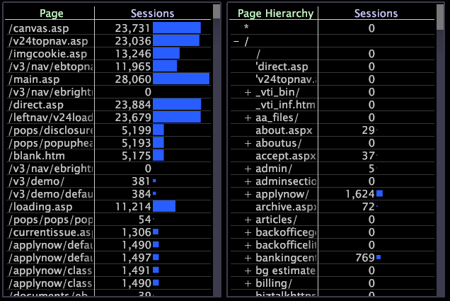

# 应用层次结构视图{#apply-hierarchy-views}

仅当使用 Site 或 HBX 应用程序时，才可使用层次视图。

层次视图显示网站中的页面，这些页面按文件名层次进行组织并按字母顺序进行排序。层次视图对于自我分析非常有用，但还可用于设置像流程图那样的高级可视化。有关流程图的详细信息，请参阅[流程图](../../../../home/c-get-started/c-analysis-vis/c-proc-maps/c-proc-maps.md#concept-880aee224404429785b733a4e80d275e)。

>[!NOTE]
>
>如果数据集已配置为在群集中的多台服务器上运行，则要使此功能正常工作，系统管理员必须指定哪台计算机将用作中央标准化服务器。 有关执行此操作的步骤，请参阅《数据集配置指南》**&#x200B;的“日志处理配置文件”一章。

**启用或禁用层次视图**

* 在任何页面或URI可视化中，右键单击页面维度的元素或标签，然后单击&#x200B;**[!UICONTROL Hierarchy View]**。

   

   当[!DNL hierarchy view]处于活动状态时，选项旁会显示一个X。

   使用树结构将层次组织为网站部分和网页。可使用节名称旁边的+或 — 符号展开或压缩节（节点）。 单个页面旁边没有+或 — 符号。

   

## 掩盖层次视图中的维度元素 {#section-e477c469934846da8d807f92fc2f3ed1}

掩盖指的是选择您数据的子集或某个维度中元素的子集。您可以掩盖或隐藏不希望在分析中包含的那些元素。使用层次视图的[!DNL Mask]菜单选项，您可以选择必须在可视化中显示元素的量度的最小百分比。

**使用菜单选项掩盖 [!DNL Mask] 数据**

1. 右键单击维度的元素或标签，然后单击&#x200B;**[!UICONTROL Mask]**。

   

1. 在“大于”下，单击相应的百分比，然后单击要掩盖的量度。

例如，如果您单击 0.1%，然后单击“页面查看次数”，那么您便是掩盖（隐藏）页面查看总次数小于 0.1% 的任何元素，从而显示页面查看总次数大于 0.1% 的任何元素。如果您单击 0%，那么您便是掩盖所选量度值为 0（零）的所有元素。
