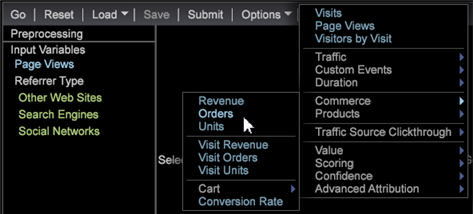

# 构建聚类{#building-clusters}

{{eol}}

选择输入变量、聚类数量以及目标人群（如果需要），以便定义数据集中的聚类。

**构建聚类**

1. 打开 **[!UICONTROL Cluster Builder]**.

   单击&#x200B;**可视化** > **预测分析** > **聚类** > **聚类生成器**。

   

1. 选择输入变量。

   * 将量度添加到 **[!UICONTROL Input Variables]** 列表 **[!UICONTROL Metric]** 菜单。

      

   * 将维度元素添加到 **[!UICONTROL Input Variables]** 列表。

      按 **[!UICONTROL Ctrl + Alt]** 并将选定的维度元素拖至 **[!UICONTROL Input Variables]** 列表或 **[!UICONTROL Element]** 框中。

      
   默认情况下，聚类会在整个数据集上执行。您可以在左侧看到所有输入变量 **[!UICONTROL Preprocessing]** 中。
1. 使用 **[!UICONTROL Options]** 菜单，以选择所需数量的群集。

   

1. 如果您要在数据集中聚集访客数的子集，则可以定义人群过滤器。

   

   首先，使用工作区中的选择或使用 **[!UICONTROL Filter Editor]**. 选择所需的子集后，在 **[!UICONTROL Options]** 菜单。 建议您为目标群组提供一个标识名称。

   的 **[!UICONTROL Options]** 菜单还具有用于控制最大刀路数和中心收敛可接受阈值的设置。

1. 配置输入和选项后，单击 **开始** 按钮在本地运行聚类或按 **[!UICONTROL Submit]** 将任务发送到预测分析服务器。 收敛完成时，提交到服务器的任务会将结果维度保存到数据集。

   当在本地运行时，您将看到聚类生成器会随其根据输入定义智能中心，在四个 Canopy 聚类阶段之间移动。

   当聚类中心停止更改超过指定的收敛阈值时，聚类维度会被收敛，并且聚类生成器将显示有关输入与每个聚类相关程度的额外信息。

1. 自定义聚类。

   右键单击统计信息的颜色条可打开一个上下文菜单，该菜单允许您自定义相关性阈值，并且对于维度元素分配，还允许选择要显示的测试。

   

   量度输入为每个聚类提供一个 T 检定，而维度元素输入为每个聚类提供三个分配测试（卡方、熵 U 统计及 Cramer&#39;s V 统计）。

   >[!NOTE]
   >
   >如果在收敛期间添加或删除输入，则该过程将暂停，直到您按 **开始** 再次。

   构建聚类后，您可以打开拾色器为不同的分配结果指定颜色。

   

1. 聚类维度收敛后，您可以将量度添加到表格中，并像往常一样做出选择。您还可以右键单击元素名称（聚类 1、聚类 2 等）来打开上下文菜单，将这些元素重命名为更有意义的名称。

   

1. 如果您希望在其他可视化图表中使用此聚类维度，则可以 **[!UICONTROL Save]** 在本地或 **[!UICONTROL Submit]** 到服务器。

如果您希望再次运行收敛或查看输入的相关性，聚类生成器也可以加载现有的聚类维度。

>[!TIP]
>
>选择后， **[!UICONTROL Reset]** 将完全发布所有输入变量，并为您提供一个空白的聚类生成器可视化以定义新聚类。
