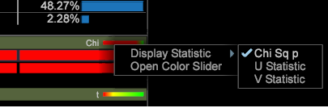

# 构建聚类{#building-clusters}

选择输入变量、聚类数量以及目标人群（如果需要），以便定义数据集中的聚类。

**构建聚类**

1. 打开 **[!UICONTROL Cluster Builder]**.

   单击&#x200B;**可视化** > **预测分析** > **聚类** > **聚类生成器**。

   

1. 选择输入变量。

   * 从工具栏的&#x200B;**[!UICONTROL Metric]**&#x200B;菜单中选择，将量度添加到&#x200B;**[!UICONTROL Input Variables]**&#x200B;列表。

      

   * 通过从Dimension的表中拖动维元素，将维元素添加到&#x200B;**[!UICONTROL Input Variables]**&#x200B;列表。

      按&#x200B;**[!UICONTROL Ctrl + Alt]**&#x200B;并将选定的维度元素拖动到工具栏中的&#x200B;**[!UICONTROL Input Variables]**&#x200B;列表或&#x200B;**[!UICONTROL Element]**&#x200B;框。

      
   默认情况下，聚类会在整个数据集上执行。在左侧&#x200B;**[!UICONTROL Preprocessing]**&#x200B;窗格中可以看到所有输入变量。
1. 使用&#x200B;**[!UICONTROL Options]**&#x200B;菜单选择所需数量的群集。

   

1. 如果您要在数据集中聚集访客数的子集，则可以定义人群过滤器。

   

   开始，方法是使用工作区中的选择或使用&#x200B;**[!UICONTROL Filter Editor]**&#x200B;定义所需的子集。 选择所需子集后，在&#x200B;**[!UICONTROL Options]**&#x200B;菜单中设置“目标填充”。 建议您为目标群组提供一个标识名称。

   **[!UICONTROL Options]**&#x200B;菜单还具有控制最大刀路数和中心收敛可接受阈值的设置。

1. 配置输入和选项后，单击&#x200B;**Go**&#x200B;按钮在本地运行群集，或按&#x200B;**[!UICONTROL Submit]**&#x200B;将任务发送到Predictive Analytics Server。 收敛完成时，提交到服务器的任务会将结果维度保存到数据集。

   当在本地运行时，您将看到聚类生成器会随其根据输入定义智能中心，在四个 Canopy 聚类阶段之间移动。

   当聚类中心停止更改超过指定的收敛阈值时，聚类维度会被收敛，并且聚类生成器将显示有关输入与每个聚类相关程度的额外信息。

1. 自定义聚类。

   右键单击统计信息的颜色条可打开一个上下文菜单，该菜单允许您自定义相关性阈值，并且对于维度元素分配，还允许选择要显示的测试。

   

   量度输入为每个聚类提供一个 T 检定，而维度元素输入为每个聚类提供三个分配测试（卡方、熵 U 统计及 Cramer&#39;s V 统计）。

   >[!NOTE]
   >
   >如果在收敛期间添加或删除输入，该过程将暂停，直到再次按&#x200B;**Go**。

   构建聚类后，您可以打开拾色器为不同的分配结果指定颜色。

   

1. 聚类维度收敛后，您可以将量度添加到表格中，并像往常一样做出选择。您还可以右键单击元素名称（聚类 1、聚类 2 等）来打开上下文菜单，将这些元素重命名为更有意义的名称。

   

1. 如果要在其他可视化中使用此群集维度，可以&#x200B;**[!UICONTROL Save]**&#x200B;在本地使用它，或&#x200B;**[!UICONTROL Submit]**&#x200B;将它发送到服务器。

如果您希望再次运行收敛或查看输入的相关性，聚类生成器也可以加载现有的聚类维度。

>[!TIP]
>
>选择&#x200B;**[!UICONTROL Reset]**&#x200B;后，将完全释放所有输入变量，并为您提供一个空白的群集生成器可视化来定义新群集。
