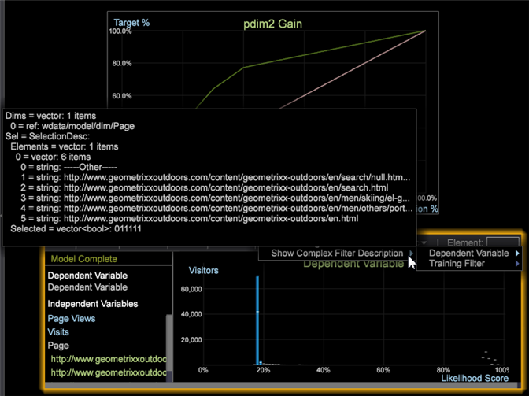

# 复杂过滤器说明{#complex-filter-description}

您可以为“因变量”和“训练过滤器”添加“显示复杂过滤器说明”。

要执 **[!UICONTROL Show the Complex Filter Description]**&#x200B;行此操作，请从评分对话框中选择 [!DNL Options > Show Complex Filter Description]。

