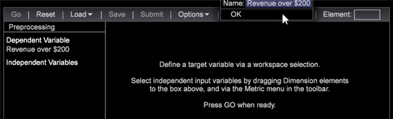

# 设置倾向打分{#setting-up-propensity-scoring}

{{eol}}

按照以下步骤使用“倾向评分”可视化。

1. 打开新工作区并单击 **[!UICONTROL Add]** > **[!UICONTROL Visualization]** > **[!UICONTROL Predictive Analytics]** > **[!UICONTROL Scoring]** > **[!UICONTROL Propensity Score]**.

   

1. 设置 **[!UICONTROL Target]** （因变量）。

   通过选择以下项设置因变量：

* **Dimension元素**:在工作区中右键单击并选择 **[!UICONTROL Table]**. 然后选择一个维度元素作为您的因变量。

   或者

* **[!UICONTROL Filter Editor]**。单击 **[!UICONTROL Add]** > **[!UICONTROL Visualization]** > **[!UICONTROL Filter Editor]** 打开过滤器编辑器可视化。

   

   选择Dimension元素或过滤器作为因变量后，单击 **[!UICONTROL Set Target]**，输入用于描述因变量的名称。 然后，单击 **[!UICONTROL OK]** （并确保突出显示过滤器框）以设置目标。

   

   您为目标提供的名称即是因变量，将显示在左侧窗格中。
1. 添加独立变量。

   使用量度或维度元素添加独立变量。

   

* **指标**. 从“倾向评分”工具栏中，从 **[!UICONTROL Metrics]** 菜单。

* **Dimension元素**:在工作区中右键单击并选择 **[!UICONTROL Table]**. 选择一个或多个Dimension元素，然后拖动到 **[!UICONTROL Independent Variables]** 或 **[!UICONTROL Element]** 框 `<Ctrl>` + `<Alt>` 键。

1. 已设置 **[!UICONTROL Training Filter]**. 您可以通过单击 **[!UICONTROL Options]** > **[!UICONTROL Set Training Filter]** 从“倾向评分”工具栏。 这将提供一组数据子集（专门由要进行评分的访客所构建）。例如，在上月进行过访问的访客，在澳大利亚居住的访客，或查看过特定产品的访客。

   默认过滤器为 **[!UICONTROL Train on Everyone]**，但您可以通过激活 **[!UICONTROL Dimension Elements]** 或使用 **[!UICONTROL Filter Editor]**.

   选择Dimension元素或构建过滤器后，在激活时，单击 **选项** > **设置培训过滤器**，输入用于描述过滤器的名称，然后单击 **[!UICONTROL OK]**.
1. 识别所有输入后，按 **[!UICONTROL Go]**.

   

   多次传递数据，即开始评分过程。随后，它将以条形图的形式，透过一条百分比线显示结果。
1. 保存倾向得分。

   从 6.1 版开始，在使用“保存倾向得分”时为您提供了一个选项：

* 维度
* 维度和量度

   您最终可以保存两个文件：维度和定义的量度。

   >[!NOTE]
   >
   >注意：如果提交“倾向得分”进行处理，您只会得到维度。

   派生的量度是相关的平均得分量度。
1. 检查正确率。

   系统将显示 **[!UICONTROL Model Complete]** 并在流程完成时生成评分模型。

   右键单击 **[!UICONTROL Model Complete]** 将识别系统定义的评分模型的准确性。 介于0%到100%之间的值将识别访客匹配 **[!UICONTROL Target]** 变量。

   混淆矩阵提供以下四个计数的组合：实际正值 (AP)、实际负值 (AN)、预测正值 (PP) 和预测负值 (PN)。将生成的评分模型应用于余下 20% 的测试数据（对此我们知道准确答案），可获取这些数值。如果得分高于 50%，则预测为正类情况（与定义的事件匹配）。

   

<table id="table_154BDD6D294C4ED1B8C15EC33B74B199"> 
 <tbody> 
  <tr> 
   <td colname="col1"><b>正确率</b> </td> 
   <td colname="col2"> 通过识别所有预测中包含的正确预测，来表示模型的正确率。 
(TP + TN)/(TP + FP + TN + FN) 
 </td> 
  </tr> 
  <tr> 
   <td colname="col1"><b>查全率</b> </td> 
   <td colname="col2"> 识别重新标识评分模型的能力。 
<b>TP / (TP + FN)</b> 
 </td> 
  </tr> 
  <tr> 
   <td colname="col1"><b>查准率</b> </td> 
   <td colname="col2">识别差异级别。 
TP / (TP + FP) 
 </td> 
  </tr> 
 </tbody> 
</table>

1. 打开 [提升图或增益图](../../../../home/c-get-started/c-analysis-vis/c-visitor-propensity/c-propensity-gain-lift-chart.md#concept-0d049f6baf534f7fb97f271843ba6c4a)，或 [模型查看器](../../../../home/c-get-started/c-analysis-vis/c-visitor-propensity/c-propensity-model-viewer.md#concept-9f2593a8218140b7bd132a4c74e159f9).

   右键单击 **模型完成** 可视化和选择 **[!UICONTROL Lift Chart]**, **[!UICONTROL Gain Chart]**&#x200B;或 **[!UICONTROL Model Viewer.]**
