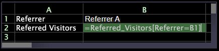

# 创建输入单元格{#create-an-input-cell}

如何创建输入单元格。

When cell B1 is formatted as an input cell (by right-clicking the cell and clicking **[!UICONTROL Format]** > **[!UICONTROL Input Cell]**) and you lock the visualization (by right-clicking its top border and clicking **[!UICONTROL Locked]**), you can change the value of the input cell to view results “on-the-fly.”

以下示例显示一个工作表，该工作表显示某个输入单元格的公式。

此示例显示相同的工作表，该工作表显示该输入单元格公式的结果。

在这两个示例中，第 1 行显示当前考虑的推荐人，即推荐人 A，而第 2 行显示由推荐人 A 推荐的访客数。

设置 B1 的格式并锁定可视化后，只需键入新值即可更改 B1 中列出的推荐人的值：

