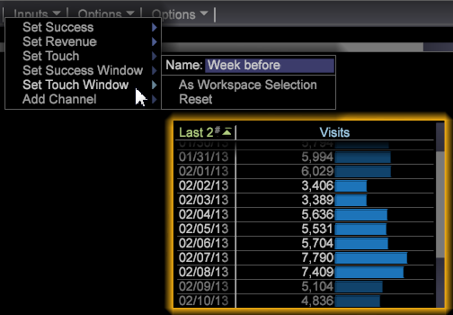

# 构建最佳拟合归因模型{#build-a-best-fit-attribution-model}

{{eol}}

从“高级”菜单中打开“最适合归因”，然后按照这些步骤构建一个最适合归因模型。

请参阅 [最适合归因](../../../../home/c-get-started/c-attribution-profiles/c-attrib-algorithmic/c-attrib-algorithmic.md#concept-237feb6e9c4d49efaf75399297dcb9d1).

1. 打开&#x200B;**最适合归因**。

   打开工作区并单击 **[!UICONTROL Premium]** > **[!UICONTROL Best Fit Attribution]**.

   

   >[!NOTE]
   >
   >最适合归因是一项Adobe Analytics Premium功能，它要求您在配置文件中启用Premium。 它需要您更新证书，并将“高级”配置文件添加到您的 profile.cfg 文件中。请参阅 [DWB服务器升级：6.2 - 6.3](/help/home/c-inst-svr/c-upgrd-uninst-sftwr/c-upgrd-sftwr/c-6-2-to-6-3-upgrade.md) (DWB 6.3)。

1. 设置 **[!UICONTROL Success]** 量度。

   >[!NOTE]
   >
   >您可以从 **[!UICONTROL Finder]** 表格，或从 **输入** 菜单。

   单击 **[!UICONTROL Inputs]** > **[!UICONTROL Set Success]**. 将打开量度菜单。 

   选择可识别成功转化的量度。

1. （可选）设置&#x200B;**收入**&#x200B;量度。

   在转化过程中设置用于评估收入的量度。

1. 设置&#x200B;**接触**&#x200B;量度。

   >[!NOTE]
   >
   >仅当您尝试通过将维度元素拖动到可视化中来自动构建成功量度时，才需要设置接触量度。

   单击 **[!UICONTROL Inputs]** 菜单和选择 **设置触控**，或从“查找器”中拖动量度。 

   这将在维度元素用作输入的情况下用于派生渠道量度。

1. 设置&#x200B;**成功**&#x200B;窗口。

   单击 [!DNL Inputs > Success Window]。从表格中选择一个日期范围，然后为成功窗口命名。单击 **[!UICONTROL Workspace Selection]** 和选定日期将被分配为成功量度的时间范围。

   

   >[!NOTE]
   >
   >由于成功窗口是工作站选项，因此您可以在成功窗口中包含任何维度。

1. 设置 **[!UICONTROL Touch Window]**.

   单击 [!DNL Inputs > Touch Window]。从表格中选择一个日期范围，然后为该接触窗口命名。单击 **[!UICONTROL Workspace Selection]** 和选定日期将被分配为成功量度的时间范围。

   

   默认情况下， **触控** 窗口将设置为与 **[!UICONTROL Success]** 窗口。

1. （可选）设置培训过滤器。

   您还可以在工作区中指定一个&#x200B;**培训过滤器**，以便过滤访客数据。

   >[!NOTE]
   >
   >在设置成功和接触窗口时，您可以将培训过滤器应用到当前工作区选项以进一步限制您的数据。

   

   >[!NOTE]
   >
   >培训集始终由满足“成功”窗口的访客提取。 通过使用过滤器编辑器进行过滤，您可以创建一个在成功窗口中报告的访客子集。

1. 指定表示接触的渠道量度。

   将量度拖动到可视化，或从 [!DNL Inputs] > [!DNL Add Channel] 菜单。 如果您还没有针对营销活动或渠道定义的量度，但却拥有表示渠道的维度，则可视化可基于指定的接触量度为您自动构建它们。

   例如，将“接触”量度设置为 [!DNL Hits]，并给定 [!DNL dimension] 调用 [!DNL Media Type] 包含 [!DNL Email], [!DNL Press Release], [!DNL Print Ad]和 [!DNL Social Media]，则可视化图表将生成表单的渠道量度 [!DNL Hits where Media Type = Email] 将元素拖放到可视化图表时，会显示相应的变量。

1. 按“开始”****。

   最适合归因分析过程将会运行，并且图表将会根据选定的输入显示每个渠道的归因。

   >[!NOTE]
   >
   >右键单击 **模型完成** ，以查看归因模型的统计信息。

   

完成后，会有一个图表显示对应每个渠道计算的归因模型，以及&#x200B;*收入*&#x200B;量度的分配（如果设置）。此模型可在内部保存，或导出到其他系统。

>[!NOTE]
>
>**[!UICONTROL Streaming]**, **[!UICONTROL Online]** 和 **[!UICONTROL Offline]** 当基于所评估数据的延迟构建归因模型时，这些模式会产生不同的效果。 在流模式下，详细信息 **[!UICONTROL Model Complete]** 将显示消息。 在“联机”和“脱机”模式下， **[!UICONTROL Local Model Complete]** 将显示。

## “选项”菜单 {#section-22288867f6c8483a8a38410f4b948346}

**选项**&#x200B;菜单提供可用于设置和显示最适合归因分析的高级功能。

<table id="table_8F6F517B7DBF4259814BEC6D07A72EAC">
 <thead>
  <tr>
   <th colname="col1" class="entry"> “选项”菜单 </th>
   <th colname="col2" class="entry"> 描述 </th>
  </tr>
 </thead>
 <tbody>
  <tr>
   <td colname="col1">设置培训过滤器 </td>
   <td colname="col2"> 在构建归因模型时，培训过滤器可随成功窗口一起用于过滤人群。这将提供一组数据子集，其中只包含需要进行分析的访客。 
注意：有经验的用户还可利用过滤器的灵活性，以便将重点放在成功和接触窗口的时间线以外的范围。例如，除了选择时间范围外，您还可以选择一组<i>反向链接域</i>，以便只检查这些域中的用户归因。 
 </td>
  </tr>
  <tr>
   <td colname="col1"> 显示复杂过滤器说明  </td>
   <td colname="col2"> 显示培训过滤器、成功窗口和接触窗口的过滤器代码。 </td>
  </tr>
  <tr>
   <td colname="col1">保存模型 </td>
   <td colname="col2"> 保存当前的归因模型，以供今后使用。 </td>
  </tr>
  <tr>
   <td colname="col1">加载模型 </td>
   <td colname="col2"> 打开之前保存的归因模型。 </td>
  </tr>
  <tr>
   <td colname="col1">表示视图 </td>
   <td colname="col2"> 隐藏表示视图的顶部菜单栏。 </td>
  </tr>
  <tr>
   <td colname="col1"> 
<b>选项 &gt; 高级</b>中包含的功能可用于设置培训集大小，并指定在遇到类不平衡时所采取的方法。 
 </td>
   <td colname="col2"> </td>
  </tr>
  <tr>
   <td colname="col1">高级 &gt; 培训集大小 </td>
   <td colname="col2"> 
设置培训集大小。 
 
注意：默认的培训集大小为“大”（250,000 名访客）。 

    <ul id="ul_5F17C60227C34A85A2C476A32F2B5DCD">
     <li id="li_A076FC2AD0214ADDBFCFD82AEA5F0880">微小 = 50,000 </li>
     <li id="li_17E77E01D5374068BEBC80B3AD4CCD41">小 = 75,000 </li>
     <li id="li_7F6B4834742A4BFCBC3DB214425B88C3">普通 = 100,000 </li>
     <li id="li_0BB7F791603745028CFC661EBC94D8B4">大 = 250,000 </li>
     <li id="li_34B60233C84F48F1BCB8040C5195411A">超大 = 500,000 </li>
    </ul> </td>
  </tr>
  <tr>
   <td colname="col1"><b>高级 &gt; 类平衡</b> </td>
   <td colname="col2"> 
针对基于数据集大小的类不平衡问题，识别和定义要生成的输入记录的数量。 
 </td>
  </tr>
 </tbody>
</table>

| 重置和删除选项 | 描述 |
|---|---|
| **[!UICONTROL Reset Model]** | 从 **[!UICONTROL Reset]** 菜单，选择 **[!UICONTROL Reset Model]** 以清除可视化图表，但保留输入量度。 |
| **[!UICONTROL Reset All]** | 从 **[!UICONTROL Reset]** 菜单，选择 **[!UICONTROL Reset All]** 以清除可视化图表和输入量度。 |
| **[!UICONTROL Remove]** | 右键单击任何输入并选择 **[!UICONTROL Remove]** 从选定的输入中清除量度。 |
| **[!UICONTROL Remove All]** | 右键单击 *渠道* 选择 **[!UICONTROL Remove All]** 以清除所有输入量度。 |
