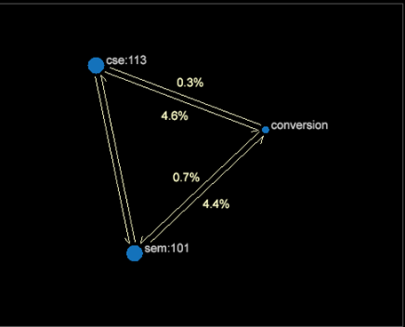

# 归因模型{#attribution-models}

共提供 7 个不同的归因模型，与归因配置文件一起用于帮助说明和量化客户营销过程。

**第一个和最后一个****模型**

第一个归因模型是传统的&#x200B;**第一次**&#x200B;和&#x200B;**最后一次**&#x200B;接触。了解转化销售的第一个步骤，或结账购买产品前的最后一次接触，可以借此了解营销活动类型：第一次接触唤起意识，最后一次接触为行动号召。

**平均分配****模型**

通过引入&#x200B;**平均分配**&#x200B;扩展了对营销参与的了解。每次符合条件的营销互动都会因该转化所产生的后续订单和收入取得同等份额。

**最初接触、中间接触和最终接触****模型**

**最初接触、中间接触和最终接触**&#x200B;模型未采取平均分配方式，而是通过可以调整的权重基于位置采用加权方式。在执行分析过程中可以评估权重。

考虑这个示例：最初接触（或第一次）获得转化收入的 30%，最终接触（或最后一次）获得 30%，所有的中间接触（中间）平分剩余的 40%。

>[!NOTE]
>
>根据订单的收入或发生情况将分配重新分配给营销互动是很常见的。 接下来的两个模型将不同的特性归因于营销互动，以评估其他成功力度。

**邻近性模型**

The Adjacency model provides visibility into the marketing position away from the conversion, answering the question: Is the marketing channel typically the 1`st` (closest), 5`th`, or 10`th` marketing channel interaction away from success?

**延迟模型**

**延迟**&#x200B;模型有助于描述营销渠道互动与成功事件之间的滞后时间。这非常有用，可以展示唤起意识和号召行动类型的营销活动，并且了解企业可以采用哪些方法从目标受众那里获取更加及时的反馈。（天数值为零 (0) 表示营销互动与成功转化发生在同一天。）

**路径模型**

路径模型提供了不同的方法用于探索客户对营销活动的参与以及客户的成功转化，在客户体验过程中的各个营销互动之间建立关系。探索流程图，了解支持营销渠道与取得成功之间的高级流程。评估路径浏览器的直接顺序营销互动。

路径浏览器可视化

**2D 流程图可视化**

**3D 流程图可视化**

