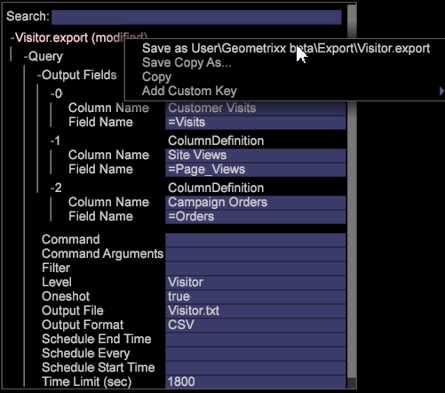

# 拥有自定义标题的区段导出{#segment-export-with-custom-headers}

为您的区段导出文件创建自定义列导出标题，以便为导出的区段添加易于理解的说明。此导出功能还允许您输出 TSV 和 CSV 文件。

已为区段导出添加新的功能，包括带有标题的导出，或以 CSV 和 TSV 格式导出。

您可以为导出文件创建列标题。

## 创建新的区段导出 {#section-cffff55855f8467ea468b71393ab7676}

1. 打开工作区，然后右键单击 **[!UICONTROL Tools]** > **[!UICONTROL Detail Table]**。

1. 右键单击并选择 **[!UICONTROL Add Level > Extended]** >选择项目。
1. 右键单击标题，然后从 **[!UICONTROL Add Attribute.]** 菜单中选择选择维。

1. 右键单击标题，然后从 **[!UICONTROL Add Metric.]** 菜单中选择选择度量。

1. 右键单击标题并选择 **[!UICONTROL New Segment Export]**。

   

   **[!UICONTROL New Segment Export with Header]** 自动填充列名和度量名称。 **[!UICONTROL New Segment Export]** 要求您设置自定义名称。 

   >[!NOTE]
   >
   >列名字段不能留空，否则标题将不存在。

1. 右键单击并命名区段，然后单击 **[!UICONTROL Save Export File]**。

   此时将打开一个导出窗口。

1. Right-click the export name and click **[!UICONTROL Save as<export filename>]**。

   

1. 右键单击 [!DNL Admin] > [!DNL Profile Manager] > [!DNL Expand Export]。 找到刚刚创建的导出文件，并将其保存到现有的配置文件中。

   

