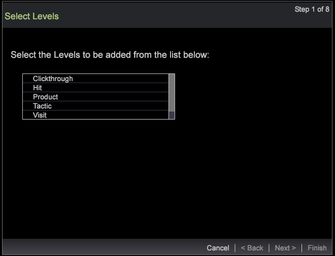
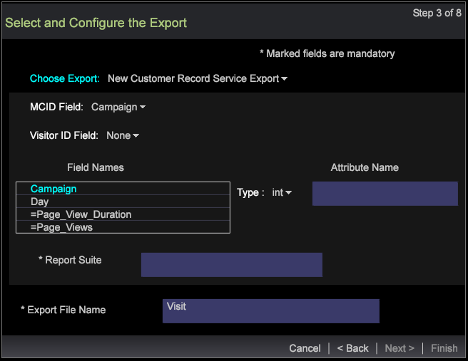

# 区段导出向导{#segment-export-wizard}

{{eol}}

使用区段导出向导导出区段

区段导出向导提供了配置和导出区段的分步流程，而不是 [从明细表导出区段](https://experienceleague.adobe.com/docs/data-workbench/using/client/export-data/c-sgmt-expt.html).

## 使用向导导出区段 {#section-b30f2699dbc7490bad18512b91cb0cb3}

要打开向导，请右键单击工作区，然后选择&#x200B;**管理员** > **向导** > **区段导出向导**。

>[!NOTE]
>
>只会捕获在打开向导之前应用的区段。 而且，通过向导创建的区段导出无法生成外部命令。

1. 选择要添加到您的导出中的维度和量度的各类父级。

   具体显示的级别取决于选定的配置文件。您可以根据配置文件选择多个维度级别。

   

1. 单击&#x200B;**下一步**。
1. 选择所选级别的维度和量度。

   例如，选择“页面视图”作为父级后，您可以选择适合导出的子维度和量度。

1. 单击&#x200B;**下一步**。

   

   

1. 选择导出的格式并输入导出文件的名称。

   

   “CSV”、“TSV”、“区段导出”和“带标题区段导出”均无需额外配置。但是，“配置文件和受众导出”、“客户记录服务”和“Adobe Target 导出”都需要按照步骤 3 进行配置。例如，请参阅“配置文件和受众导出”的各种配置字段。配置这些导出类型，然后单击&#x200B;**下一步**。

   

   

   

1. 配置所选导出类型。

   标题：如果标题为 True，则命名&#x200B;**输出文件**&#x200B;字段。

   转义字段 — 设置为 **True** 或 **False**.

   字段顺序：选择某个字段，然后上移或下移，可设置导出文件中字段的顺序。

   

   单击&#x200B;**下一步**。

1. 在这个对话框中，可查看级别和应用的过滤器。单击&#x200B;**下一步**。

1. 如果选中了 **CSV**、**TSV**、**区段导出**&#x200B;或&#x200B;**带标题区段导出**，则会出现下面三个选项：

   通用导出 - 将由 Server/Export 文件夹中的服务器生成输出文件。

   

   FTP 导出 - 输出文件将被传输到选定的服务器。（该服务器的列表是从 FTPServerInfo.cfg 文件提取的。）

   

   SFTP 导出 - 输出文件将被安全传输到选定的服务器。

1. 单击&#x200B;**下一步**

   **注意：** 如果选择的导出类型为 **用户档案和受众导出**, **自定义记录服务**&#x200B;和 **Adobe Target导出**，则根据选定的导出，文本将为静态文本。

1. 配置计划参数。

   可将&#x200B;**一次性**&#x200B;设置为 True 或 False。

   可通过单击“高级计划配置”按钮，打开或关闭&#x200B;**高级计划**。

   

   同从“明细表”导出一样，如果“高级设置”处于“打开”状态，则“一次性”将会失效。单击&#x200B;**下一步**。

1. 预览导出文件，然后单击&#x200B;**运行导出**。

   

   

使用向导时，可选用下列导出类型：

**区段导出类型**

* 通用
* FTP
* SFTP

**带标题区段导出**

* 通用
* FTP
* SFTP

**CSV 导出**

* 通用
* FTP
* SFTP

**TSV 导出**

* 通用
* FTP
* SFTP
