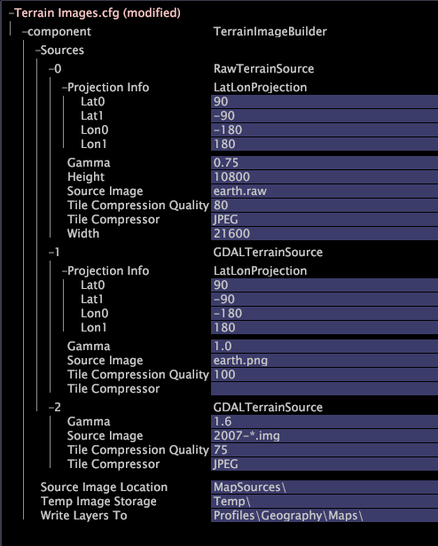

# 地形图像图层{#terrain-image-layers}

地形图像层显示地球的地形图像。

[!DNL Terrain image layers] 以自定义 [!DNL Geography] 格式存储在用户档案中。这些图像层可以通过Adobe生成，或者Data Workbench服务器可以将用户提供的地形图像转换为适合在地球可视化中使用的地形层。

>[!NOTE]
>
>要使用[!DNL terrain image layers]，必须安装由Adobe提供的[!DNL Terrain Images.cfg]文件。

若要定义地形图像层，您必须具有：

* **一个或多个地形图像文件**，其中包含要在地球上显示的图像。
* **一个 [!DNL Terrain Images.cfg] 文件**，指定要用于层的地形图像文件。[!DNL Terrain Images.cfg]文件允许您添加一个或多个源以创建[!DNL terrain image layer]。 地形图像文件的格式决定了应添加的源的类型。下表提供了可用地形图像层源的描述，其中包括受支持的地形图像文件格式：

<table id="table_CFDF5E61FCCD40B29A9D35FFA42F68D1"> 
 <thead> 
  <tr> 
   <th colname="col1" class="entry"> 类型 </th> 
   <th colname="col2" class="entry"> 描述 </th> 
  </tr> 
 </thead>
 <tbody> 
  <tr> 
   <td colname="col1"> 
原始的未投影位图 
 </td> 
   <td colname="col2"> 
通过经纬度对齐（未投影）的 24 位无标题 RGB 文件创建地形图像层，其中北面是图像的顶部，东面是右部。 
 
支持的图像格式：RAW 
 
 
注意：此源需要投影信息。有关投影格式的信息，请参阅<a href="../../../../home/c-get-started/c-im-layers/c-ter-img-layers/c-proj-info-ter-imgs.md#concept-eec35baa01744895b847a02e69dad04e">指定地形图像的投影信息</a>。 
 
 </td> 
  </tr> 
  <tr> 
   <td colname="col1"> 
未投影的一般图像 
 </td> 
   <td colname="col2"> 
通过经纬度对齐（未投影）的 24 位图像格式创建地形图像层，其中北面是图像的顶部，东面是右部。 
 
支持的图像格式：BMP、JPG、PNG、TIFF 
 
 
注意：此源需要投影信息。有关投影格式的信息，请参阅<a href="../../../../home/c-get-started/c-im-layers/c-ter-img-layers/c-proj-info-ter-imgs.md#concept-eec35baa01744895b847a02e69dad04e">指定地形图像的投影信息</a>。 
 
 </td> 
  </tr> 
  <tr> 
   <td colname="col1"> 
包含嵌入投影的图像 
 </td> 
   <td colname="col2"> 
通过可在图像文件中嵌入大地数据的图像格式创建地形图像层。投影信息提取自该图像。 
 
支持的图像格式：Erdas (IMG)、GeoTIFF 
 
 
注意：此源通常不需要投射信息，但是在需要时支持添加此类信息。有关投影格式的信息，请参阅<a href="../../../../home/c-get-started/c-im-layers/c-ter-img-layers/c-proj-info-ter-imgs.md#concept-eec35baa01744895b847a02e69dad04e">指定地形图像的投影信息</a>。 
 
 </td> 
  </tr> 
 </tbody> 
</table>

**定义地形图像层**

1. 在Data Workbench中，在&#x200B;**[!UICONTROL Admin]** > **[!UICONTROL Dataset and Profile]**&#x200B;选项卡上，单击&#x200B;**[!UICONTROL Servers Manager]**&#x200B;缩略图以打开[!DNL Servers Manager]工作区。
1. 在[!DNL Servers Manager]窗口中，右键单击所需Data Workbench服务器的图标，然后单击&#x200B;**[!UICONTROL Server Files]**。
1. 在[!DNL Server Files Manager]中，单击&#x200B;**[!UICONTROL Components]**&#x200B;视图其内容。 [!DNL Terrain Images.cfg] 文件位于此目录中。
1. 右键单击[!DNL Terrain Images.cfg]服务器名称列中的复选标记，然后单击&#x200B;**[!UICONTROL Make Local]**。 [!DNL Terrain Images.cfg]的[!DNL Temp]列中显示复选标记。
1. 右键单击&#x200B;**[!UICONTROL Temp]**&#x200B;列中新建的复选标记，然后单击&#x200B;**[!UICONTROL Open]** > **[!UICONTROL from the workbench]**。 出现[!DNL Terrain Images.cfg]窗口。
1. 在[!DNL Terrain Images]窗口中，单击&#x200B;**[!UICONTROL component]**&#x200B;视图其内容。
1. 右键单击&#x200B;**[!UICONTROL Sources]** > **[!UICONTROL Add new]**&#x200B;并选择以下源类型之一：

   * **[!UICONTROL Raw unprojected bitmap]**。（添加后，此源类型在[!DNL Terrain Images]窗口中被标记为RawTerrainSource。）

   * **[!UICONTROL General image, unprojected]**。（添加后，此源类型在[!DNL Terrain Images]窗口中标记为[!DNL GDALTerrainSource]。）

   * **[!UICONTROL Image with embedded projection]**。（添加后，此源类型在[!DNL Terrain Images]窗口中标记为[!DNL GDALTerrainSource]。）

1. 参考以下示例文件和参数表，根据需要编辑源的参数。

   

<table id="table_345ACB4C48524516AADB731D87FC6792"> 
 <thead> 
  <tr> 
   <th colname="col1" class="entry"> 参数 </th> 
   <th colname="col2" class="entry"> 描述 </th> 
  </tr>
 </thead>
 <tbody> 
  <tr> 
   <td colname="col1"> 
Gamma（伽马） 
 </td> 
   <td colname="col2"> 
对所有源可选。指定要应用于源图像的 gamma 校正。这可能是可取的，因为Data Workbench通常以高灰度系数设置运行。 默认值为 1。 
 </td> 
  </tr> 
  <tr> 
   <td colname="col1"> 
Height（高度） 
 </td> 
   <td colname="col2"> 
原始未投影位图图像的必选参数。源图像的高度（以像素为单位）。 
 </td> 
  </tr> 
  <tr> 
   <td colname="col1"> 
Projection Info（投影信息） 
 </td> 
   <td colname="col2"> 
原始的未投影位图图像和未投影的一般图像需要该参数，但具有内嵌投影的图像支持该参数。Data Workbench支持地形图像层的经纬度投影和横向墨卡托(TM)投影。 默认的投影格式为经纬度投影 (LatLonProjection)。 
 
有关投影格式的信息，请参阅 <a href="../../../../home/c-get-started/c-im-layers/c-ter-img-layers/c-proj-info-ter-imgs.md#concept-eec35baa01744895b847a02e69dad04e"> 指定地形图像的投影信息</a>. 
 </td> 
  </tr> 
  <tr> 
   <td colname="col1"> 
Source Image（源图像） 
 </td> 
   <td colname="col2"> 
所有源的必选参数。源图像文件的名称。这可能是文件名称或通配符模式。在有些情况下使用模式可能非常有用，例如，上传同一地区、具有不同日期，且相关元数据无更改的图像。因此，在添加新图像时，像 Tysons Corner *.raw 这样的模式会通过 Tysons Corner 050211.raw、Tysons Corner 050218.raw 等创建层，如果文件的参数相同，则不需要进行其他配置。 
 </td> 
  </tr> 
  <tr> 
   <td colname="col1"> 
Tile Compression Quality（图块压缩质量） 
 </td> 
   <td colname="col2"> 
对所有源可选。对于 JPEG 压缩，为从 0 到 100 的整数，用来指定如何平衡图像大小和质量。（默认值为零。）数量越大，图像质量越好，但图像的质量越大，Data Workbench用户的下载时间也越长。 
 
 
注意：将图像压缩到 70 以下可能导致图像降级。 
 
 </td> 
  </tr> 
  <tr> 
   <td colname="col1"> 
Tile Compressor（图块压缩程序） 
 </td> 
   <td colname="col2"> 
对所有源可选。指定用于写入输出文件的压缩方式。当前唯一支持的方式为 RAWRGB（默认设置，其结果是无压缩）和 JPEG。使用 JPEG 压缩可减少在配置文件同步期间传输的层的大小。 
 </td> 
  </tr> 
  <tr> 
   <td colname="col1"> 
Width（宽度） 
 </td> 
   <td colname="col2"> 
原始未投影位图图像的必选参数。源图像的宽度（以像素为单位）。 
 </td> 
  </tr> 
 </tbody> 
</table>

1. 参考下表，编辑 Source Image Location（源图像位置）、Temp Image Storage（临时图像存储）和 Write Layers To（写入层）参数。这些参数适用于该文件 [!DNL Sources]（源）部分中定义的所有地形图像源。

<table id="table_103F02C54ED94C6C922450F5B2781CAE"> 
 <thead> 
  <tr> 
   <th colname="col1" class="entry"> 参数 </th> 
   <th colname="col2" class="entry"> 描述 </th> 
  </tr>
 </thead>
 <tbody> 
  <tr> 
   <td colname="col1"> 
Source Image Location（源图像位置） 
 </td> 
   <td colname="col2"> 
必需. 进行扫描以查找要转换为地形层的图像的目录。如果它不是绝对路径，则它将解释为相对于Data Workbench服务器安装目录。 
 </td> 
  </tr> 
  <tr> 
   <td colname="col1"> 
Temp Image Storage（临时图像存储） 
 </td> 
   <td colname="col2"> 
可选。用于存储将源图像转换为地形层时所用临时文件的目录名称。如果它不是绝对路径，则它将解释为相对于Data Workbench服务器安装目录。 默认位置为 Temp 目录。 
 </td> 
  </tr> 
  <tr> 
   <td colname="col1"> 
Write Layers To（写入层） 
 </td> 
   <td colname="col2"> 
必需. 地形层输出到的目录。通常情况下，这是配置文件目录的 Maps 子目录，以便地球可视化可以找到相关的层。 
 </td> 
  </tr> 
 </tbody> 
</table>

1. 右键单击窗口顶部的&#x200B;**[!UICONTROL (modified)]**&#x200B;并单击&#x200B;**[!UICONTROL Save]**&#x200B;保存文件。
1. 要将更新的文件保存到Data Workbench服务器计算机，请在[!DNL Server Files Manager]中右键单击[!DNL Temp]列中[!DNL Terrain Images.cfg]的复选标记，然后单击&#x200B;**[!UICONTROL Save to]** > *&lt;**[!UICONTROL server name]**>*。
