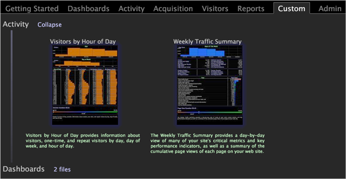
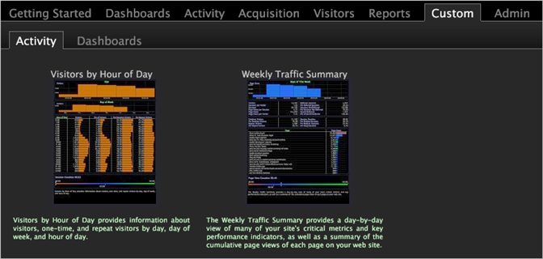

# 将子文件夹显示为子选项卡{#display-subfolders-as-subtabs}

默认情况下，新创建的选项卡将相关联目录中的子文件夹显示为分层的下拉子目录，而不是子选项卡。

You can display subfolders as subtabs (as shown in the following example) by placing an [!DNL empty folder.useTabs] file in the *working profile name*\Workspaces\*tab name folder* within the Data Workbench installation directory.

The following example shows the [!DNL Custom] tab with drop-down subdirectories.

If you place an [!DNL empty folder.useTabs] file in the Workspaces\Custom folder, all of the subfolders within the Custom folder display in the [!DNL Worktop] as subtabs, as shown in the following example:

**在[!DNL Worktop]**中将子文件夹显示为子选项卡

>[!NOTE]
>
>Each directory level must have a [!DNL Tab Name.useTabs] file for the contents of the subfolder to appear as subtabs instead of hierarchical, drop-down subdirectories.

1. 在中， [!DNL Profile Manager]单击以 **[!UICONTROL Workspaces]** 查看其内容。
1. In the *working profile name* column, right-click the check mark for one of the [!DNL folder.useTabs] files and click **[!UICONTROL Copy]**.
1. Right-click in the [!DNL User] column for the Workspaces\*tab name* folder and click **[!UICONTROL Paste]**. 现在选项卡中的子文件夹将显示为子选项卡。
1. (Optional) To make this change available to all users of the working profile, right-click the white check mark for the [!DNL new folder.useTabs] file in the [!DNL User] column and click **[!UICONTROL Save to]** > &lt; **[!UICONTROL working profile name]**>.

