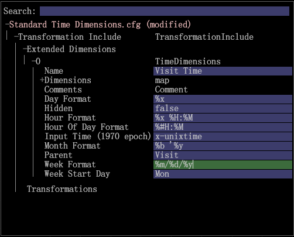

# 本地化时间维度{#localizing-time-dimensions}

配置时间维度以正确显示区域设置。

You can configure the displayed format of time dimensions based on locale in the **[!DNL Standard Time Dimensions.cfg]** file (located by default at **[!DNL Server/Profiles/`<my profile>`/Dataset/Transformation/Time/Standard Time Dimensions.cfg]**).

For example, in North America you can express the date May 3rd, 2015 as 5/3/15, or **`%m/%d/%y`**. However, in other parts of the world this could be interpreted as `%d/%m/%y`, or March 5th, 2015 due to an ambiguity in the values. 为了避免出现这种情况，管理员可能需要更改显示格式以满足某个区域设置中用户的期望。

## 1. Override Default Time Dimensions in Standard Time Dimensions.cfg {#section-7d0b24657bef4b15abb3cbea66cb617f}

若要启用这项功能，管理员必须覆盖默认设置，具体方法是：编辑现有的时间维度，或者使用其他参数创建新的时间维度。

下面是有关修改时间维度的示例。

在这个示例中，星期、小时、天、月份以及一天每个小时的&#x200B;**格式**&#x200B;值都被设置为默认值。

>[!NOTE]
>
>如果忽略这些行，Data Workbench的行为将不会更改，维将使用默认值进行编译。

```
Transformation Include = TransformationInclude:  
  Extended Dimensions = vector: 1 items 
    0 = TimeDimensions:  
      Comments = Comment: 0 items 
      Dimensions = map:  
        Day = string: Day 
        Day of Week = string: Day of Week 
        Hour = string: Hour 
        Hour of Day = string: Hour of Day 
        Month = string: Month 
        Week = string: Week 
      Hidden = bool: false 
      Input Time (1970 epoch) = string: x-unixtime 
      Week Format = string:  
  %m/%d/%y
      Hour Format = string:  
  %x %H:%M 
      Day Format = string:  
  %x
      Month Format = string:  
  %b '%y
      Hour Of Day Format = string:  
  %#H:%M
      Name = string: Visit Time 
      Parent = string: Visit 
      Week Start Day = string: Mon 
  Transformations = vector: 0 items
```



## 2. 配置 meta.cfg 文件 {#section-5e077d3298dd48fda7f7bb16af9ea00c}

此外，包管理员有必要将这些参数及其默认设置添加到配置文件的 **[!DNL meta.cfg]** 文件中。这样操作后可以通过工作站进行编辑。

下面是有关一个已配置的 **[!DNL meta.cfg]** 文件的摘要。

```
dimensions = vector: 6 items 
  0 = Template: 
    ...
  ...
  5 = Template: 
    name = string: Time Dimensions 
    value = TimeDimensions: 
      Name = string:  
      Comments = Comment: 0 items 
      Hidden = bool: false 
       
  Week Format = string: %d/%m/%y 
       Hour Format = string: %x %H:%M 
       Day Format = string: %x 
       Month Format = string: %b '%y 
       Hour Of Day Format = string: %#H:%M</b> 
      Input Time (1970 epoch) = string:  
      Parent = string:  
      Week Start Day = string: Mon 
      Dimensions = map: 
        Hour of Day = string: Hour of Day 
        Day of Week = string: Day of Week 
        Hour = string: Hour 
        Day = string: Day 
        Week = string: Week 
        Month = string: Month
```

下面是工作站中的一个 **[!DNL meta.cfg]** 文件示例：


接下来，管理员可以进入&#x200B;**文件管理器**，打开配置时间维度的文件（例如 **[!DNL Standard Time Dimensions.cfg]**），然后，在工作站中对其进行编辑。
