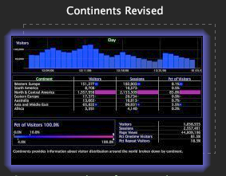

# 文件版本控制{#file-versioning}

Worktop可轻松确定每个特定工作区的存储位置，无论是在Data Workbench Server、您的本地计算机上，还是同时存储在这两个工作区上。

## Identifying file versions {#section-d555c96b016344f19b356c12213dd2a9}

**服务器**

服务器工作区存储在连接的Data Workbench服务器上，可供有权访问此配置文件和选项卡的所有用户使用。 服务器工作区显示为单个缩略图。

默认情况下，服务器工作区存储在连接的Data Workbench服务器上Workspaces文件夹中的相应子文件夹中。

**本地**

本地工作区是本地版本的服务器工作区。本地工作区显示为两个重叠的缩略图。最初上面的缩略图周围有一圈光晕，这表示最近在本地对服务器工作区进行了更改。此光晕会随时间而消散。

本地工作区默认存储在Data Workbench( [!DNL User\working profile name\Workspaces\tab] 或Insight)安装目录的名称文件夹中。

>[!NOTE]
>
>当您有服务器工作区的本地版本时，必须先还原到服务器版本，然后才能下载服务器工作区的更新版本。 To revert back to the server version without local changes, right-click the thumbnail of the local workspace and click **[!UICONTROL Revert to server version]**.

**用户**

用户工作区是在本地计算机上创建且仅存在于本地计算机上的工作区。用户工作区显示为单个缩略图，其后面有一个空白工作区的虚线轮廓，表明连接的Data Workbench服务器上没有源工作区。

默认情况下，用户工作区存储在Insight安装目录的User\*工作配置文件名称*\Workspaces\*选项卡名称*文件夹中。
