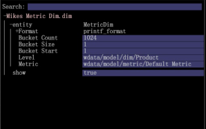

# 编辑量度维度{#editing-the-metric-dim}

{{eol}}

在配置文件管理器中编辑量度维度。

编辑现有量度维度：

1. 在工作区中，右键单击&#x200B;**管理员** > **配置文件管理器**。打开&#x200B;**维度**&#x200B;并选择量度维度。 

1. 右键单击用户列中的复选标记，选择 **打开** 然后选择量度维度。 

1. 在“编辑量度维度”框中，根据需要进行更改。 
