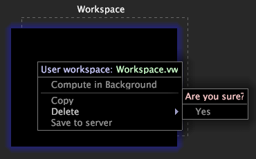

# 删除工作区{#deleting-a-workspaces}

有关从 Worktop 中删除工作区的信息。

本地工作区是存在于服务器上的工作区的本地版本。用户工作区仅存在于本地计算机上。

**从[!DNL Worktop]**中删除本地工作区

Right-click the workspace that you want to delete and click **[!UICONTROL Revert to server version]** > **[!UICONTROL Yes]**. 本地版本将被删除，但服务器版本仍然存在。

>[!NOTE]
>
>当您拥有服务器工作区的本地版本时，您必须先还原到服务器版本，然后才能下载服务器工作区的更新版本，从而丢失所做的更改。

**从[!DNL Worktop]**中删除用户工作区

Right-click the workspace that you want to delete and click **[!UICONTROL Delete]**.

